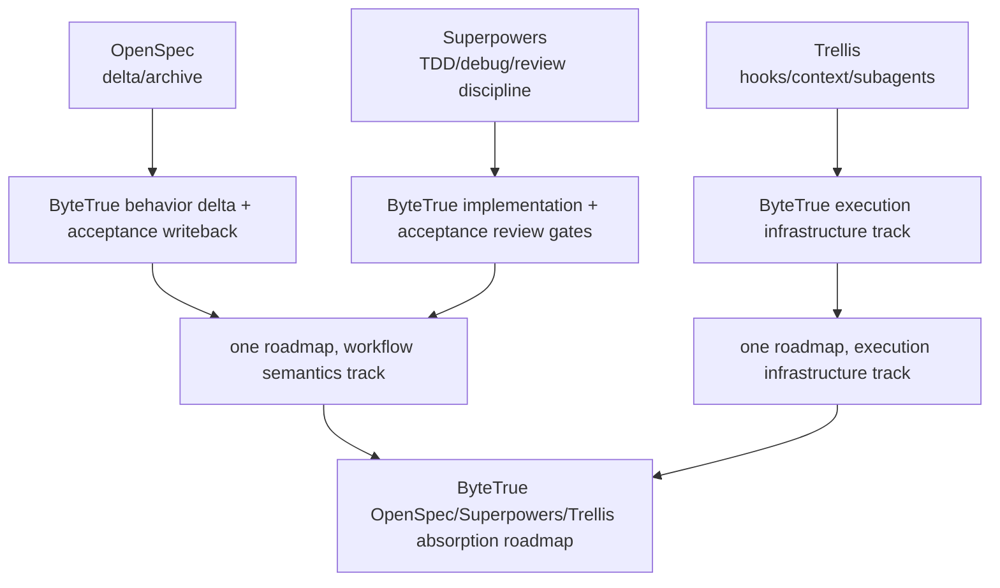

## Question and Scope

What should ByteTrue learn from OpenSpec, Superpowers, and Trellis, and which mechanisms should be absorbed into the existing ByteTrue lifecycle without creating a competing source-of-truth layer?

Scope covered three local workflow repositories:

- OpenSpec: `/Users/byte/workspace/forks/ai-workflow/openspec`
- Superpowers: `/Users/byte/workspace/forks/ai-workflow/superpowers`
- Trellis: `/Users/byte/workspace/forks/ai-workflow/trellis`

## Short Answer

OpenSpec contributes the strongest **delta/archive behavior-contract** model. Superpowers contributes the strongest **agent behavior discipline and review loop**. Trellis contributes the strongest **execution infrastructure**: task directories, curated context manifests, workflow-state breadcrumbs, hooks, subagent roles, and finish/update-spec loops.

Do not copy any one system wholesale. ByteTrue should keep its existing `.bytetrue/` source-of-truth layers and absorb the useful mechanisms as lifecycle additions:

Two upstream decisions have already converged:

1. Do not add `.bytetrue/specs/`; use existing `requirements/`, `architecture/`, `features/`, `roadmap/`, `compound/`, and `reference/` layers.
2. Put prompt/workflow improvements and Pi/Trellis-style infrastructure improvements into one roadmap, split into two tracks: workflow semantics and execution infrastructure.

## Key Evidence

1. OpenSpec explicitly defines `specs/` as current system behavior and `changes/` as proposed modifications; archive merges deltas into source of truth (`openspec/docs/concepts.md:46-50`).
2. OpenSpec delta specs are the brownfield key mechanism and describe what changes instead of restating the entire spec (`openspec/docs/concepts.md:490-492`).
3. OpenSpec's schema declares a default artifact DAG: proposal → specs → design → tasks (`openspec/schemas/spec-driven/schema.yaml:1-4`) and makes proposal capabilities the contract into spec creation (`openspec/schemas/spec-driven/schema.yaml:15-22`).
4. Superpowers' basic workflow requires brainstorming, isolated worktree setup, bite-sized writing plans, subagent or batch execution, TDD, code review, and branch finishing (`superpowers/README.md:154-170`).
5. Superpowers subagent-driven development uses one fresh subagent per task and two-stage review: spec compliance before code quality (`superpowers/skills/subagent-driven-development/SKILL.md:8-14`).
6. Trellis positions its distinctive value as auto-injected specs, task-centered workflow, project memory, and team-shared standards (`trellis/README.md:39-47`).
7. Trellis' runtime loop creates a PRD, sends research-heavy items to research subagents, injects curated context via `implement.jsonl` / `check.jsonl`, then verifies and promotes learnings back to `.trellis/spec/` (`trellis/README.md:80-85`).
8. Trellis' workflow-state breadcrumb and Pi-aware subagent dispatch distinguish default subagent mode from inline mode, and require dispatch prompts to start with `Active task: ...` as a hook-failure fallback (`trellis/.trellis/workflow.md:197-214`).

## Detailed Expansion

### OpenSpec absorption shape

Absorb the delta/archive discipline, not the directory shape. OpenSpec's `specs/` layer overlaps with ByteTrue's existing source-of-truth split, but its delta sections and archive merge logic are valuable. ByteTrue should express behavior deltas in feature/roadmap artifacts and materialize accepted outcomes into existing layers during acceptance.

### Superpowers absorption shape

Treat Matt-derived TDD/debug/architecture language as a first pass, not a final best answer. Compare and fuse it with Superpowers:

- TDD: keep ByteTrue's public-interface / vertical-slice rhythm, and add Superpowers-style strict red-first evidence for regression-sensitive or high-risk behavior.
- Debug: keep Matt's diagnosis vocabulary, and add Superpowers' no-root-cause-no-fix, single-hypothesis testing, instrumentation-at-boundaries, and 3-failed-fixes-mean-architecture-question rules.
- Architecture: keep Matt's deep-module / shallow-module / seam / deletion-test language, and add Superpowers' enforcement that implementation is reviewed first for spec compliance, then for code quality.

### Trellis absorption shape

Trellis should mainly influence ByteTrue's execution infrastructure:

- context manifests for implement/check agents;
- workflow-state breadcrumbs or hook-injected stage reminders;
- Pi-specific subagent role handoff rules;
- research-first artifacts for technical choices;
- finish/update-spec style post-work knowledge capture.

These should be introduced as infrastructure supporting ByteTrue skills, not as a parallel `.trellis/` clone.

## Open Questions

- What is the minimal version of a ByteTrue context manifest: one file, two files (`impl` / `check`), or embedded in checklist YAML?
- Should workflow-state breadcrumbs be implemented first as documentation conventions, Pi extension hooks, or generated per-project guidance blocks?
- Which parts of Superpowers' strict TDD should be mandatory versus risk-triggered?
- Should finish/journal become a ByteTrue feature now, or remain a later infrastructure idea?

## Suggested Next Step

Continue the grill to settle the minimal roadmap shape, then create a ByteTrue roadmap for absorbing OpenSpec, Superpowers, and Trellis as one large demand with separate workflow-semantics and execution-infrastructure tracks.

## Related Documents

- `.bytetrue/compound/2026-06-11-decision-no-separate-specs-layer.md`
- `.bytetrue/roadmap/matt-skills-absorption/matt-skills-absorption-roadmap.md`
- `.bytetrue/reference/domain-context.md`
