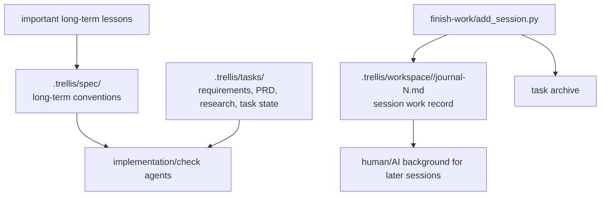

## Question and Scope

Is Trellis journal only useful for weekly reports, or does it affect workflow execution, task recovery, context injection, or knowledge capture?

Investigated files include Trellis README, workflow scripts, session hooks, finish-work prompt, workspace memory reference, and actual journal samples.

## Short Answer

Trellis journal is not only a weekly-report feature. Its core role is **cross-session work memory**: a per-developer chronological record of completed or partially completed sessions, linked to tasks, commits, branches, testing, and next steps.

However, journal is **not the primary execution source of truth**. Trellis separates responsibilities:

For ByteTrue, the useful idea is not raw chat journaling. It is a **work-record layer** that records what happened across tasks and sessions, enough to support weekly reports, handoff, resumption background, and audit of AI work. It should remain secondary to feature/issue/roadmap/compound artifacts.

## Key Evidence

1. Trellis README markets project memory as journals preserving what happened last time so new sessions start with real context (`trellis/README.md:43-45`).
2. The user flow says `/trellis:finish-work` archives the task and updates journals (`trellis/README.md:73-76`).
3. Trellis finish also promotes durable learnings to `.trellis/spec/`, which shows journal is not the long-term convention store (`trellis/README.md:80-85`).
4. The workspace memory reference says `.trellis/tasks/` stores task-specific requirements/design/research/state, `.trellis/workspace/` stores work records across tasks/sessions, and `.trellis/spec/` stores long-term conventions (`trellis/.pi/skills/trellis-meta/references/local-architecture/workspace-memory.md:48-58`).
5. The same reference warns that AI should read the current task first, then use workspace as background; workspace is not the only source of truth (`trellis/.pi/skills/trellis-meta/references/local-architecture/workspace-memory.md:69-71`).
6. `add_session.py` records session title, date, task, optional package/branch, summary, main changes, commits, testing, status, and next steps (`trellis/.trellis/scripts/add_session.py:141-194`).
7. `add_session.py` updates a per-developer index with active journal file, total sessions, last active date, active documents, and session history (`trellis/.trellis/scripts/add_session.py:197-309`).
8. Trellis session context includes the active journal file and near-limit status in JSON/text output, but mainly injects developer, git status, current task, active tasks, and spec paths (`trellis/.trellis/scripts/common/session_context.py:261-323`, `trellis/.trellis/scripts/common/session_context.py:345-488`).
9. Actual journals are concise work records, not full transcripts: each session contains a dense summary, commit hashes, testing, status, and next steps (`trellis/.trellis/workspace/taosu/journal-5.md:10-41`).
10. Actual per-developer index works as a chronological report table with date, title, commits, and branch (`trellis/.trellis/workspace/taosu/index.md:31-120`).

## Detailed Expansion

### What journal does

Trellis journal supports:

- cross-session recall: what happened last session, including partial work;
- human reporting: weekly/status reports can be produced from the chronological session table and summaries;
- handoff: another human or agent can scan recent sessions and commits;
- auditability: work sessions are linked to commits, branch, tests, and status;
- context hygiene: long session content is distilled into file records instead of relying on chat memory.

### What journal does not do

Journal is not where Trellis stores primary requirements, implementation context, or durable coding rules:

- task-specific truth stays in `.trellis/tasks/{task}/prd.md`, `research/`, `implement.jsonl`, `check.jsonl`, and `task.json`;
- long-term conventions go to `.trellis/spec/` via update-spec;
- session-start context may mention active journal file, but task/spec context drives execution.

### ByteTrue mapping

ByteTrue already has strong formal artifacts:

- `features/`, `issues/`, `refactors/` for concrete work;
- `roadmap/` for multi-feature plans;
- `compound/` for durable decisions/learnings/explores/tricks;
- `attention.md` for startup notes.

What ByteTrue lacks is a lightweight chronological **work record** that spans formal artifacts and captures work sessions that are not yet acceptance/fix-note complete.

A ByteTrue version should therefore be closer to a **worklog/report feed** than a raw transcript journal:

- one short record per session or meaningful work interval;
- links to current feature/issue/roadmap/compound docs;
- commit hashes and verification commands;
- status and next steps;
- optional per-developer grouping if teams need it.

## Open Questions

- Should ByteTrue work records be per-developer, per-project chronological, or per-artifact append-only?
- Should this be mandatory at `bt-feat-accept` / `bt-issue-fix` closeout only, or also available for partial sessions?
- Should the path be `.bytetrue/worklog/` or should records live under existing artifact directories?
- Should Magic Context / Pi session history be summarized into worklog automatically, or should the agent write a human-readable summary only at closeout?

## Suggested Next Step

Treat Trellis journal as a candidate execution-infrastructure sub-feature: design a lightweight ByteTrue worklog/report-feed after the core context manifest and subagent handoff are stable.

## Related Documents

- `.bytetrue/compound/2026-06-11-explore-ai-workflow-comparison.md`
- `.bytetrue/compound/2026-06-11-decision-no-separate-specs-layer.md`
