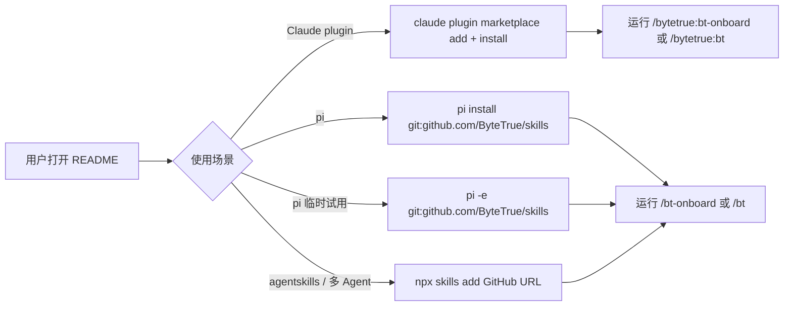

# pi-package-install design

## 0. 术语约定

- **pi package**：pi 原生安装单元，通过 `pi install` 从 npm / git / URL / 本地路径安装，资源由 `package.json` 的 `pi` manifest 或约定目录声明。和 npm package 可以重合，但第一阶段不要求发布到 npm。
- **skill resource**：pi package 中的 `skills` 资源；本仓库的一级目录 `*/SKILL.md` 是要被注册的资源入口。
- **现有 skills CLI 安装**：README 当前的 `npx skills add https://github.com/ByteTrue/skills` 路径，面向 agentskills / Claude 风格安装。新能力不替代它。
- **pi extension**：pi 中可执行 TypeScript / JavaScript 扩展。防冲突结论：本 feature 实际新增的是 pi package 安装 ByteTrue skills，不新增 runtime extension 代码。

## 1. 决策与约束

### 需求摘要

为当前 ByteTrue skills 仓库增加 pi 原生安装方式，并把仓库目录整理为同时兼容 `npx skills`、pi package、Claude Code plugin 的标准 `skills/` 结构。

成功标准：

- 仓库根目录存在 pi 可识别的 package manifest。
- manifest 只注册 28 个 `skills/*/SKILL.md`，不把 README、reference.md、docs 误注册成 skill。
- README 中文 / 英文安装段同时给出 Claude plugin、pi 原生安装和现有 `npx skills add` 安装。
- `npx skills add <repo-root> --list` 能从 `skills/` 下识别全部 skills。

明确不做：

- 不发布 npm 包；只让仓库具备将来 npm 发布所需的基础 metadata。
- 不把 skill 内容复制成第二份；目录迁移后 `skills/` 是 canonical 源码。
- 不新增 pi runtime extension 代码。
- 不改任何 `SKILL.md` 行为内容。
- 不改 `.pi/settings.json` 或用户全局 pi settings。

### 复杂度档位

按“对外发布的库/服务”默认档位处理：L3 + modules + budgeted + public + stable + traced + tested + validated。偏离点：

- 性能从 `budgeted` 降到 `reasonable`：manifest 解析是启动期资源发现，只有 28 个静态入口，不需要性能预算。
- 可观测性从 `traced` 降到 `opaque`：本 feature 只是静态 package metadata，无运行期链路。
- 安全性从 `validated` 降到 `trusted`：不执行新增代码；安装安全提示沿用 pi 官方 package 文档。

### 关键决策

1. **把仓库整理为标准 `skills/` 二级目录。**
   - 选择：把 28 个 skill 目录迁移到 `skills/{skill-name}/SKILL.md`。
   - 原因：这是 Claude Code plugin 默认结构，也是 `npx skills` 官方 discovery 支持的标准目录；pi package 可通过 manifest 指向该路径。

2. **pi manifest 使用 `./skills/*/SKILL.md`。**
   - 选择：只匹配 `skills/` 下每个 skill 的入口文件。
   - 拒绝：使用 `./` 或 `./**/*.md`。原因是会把 README / reference 文档纳入资源发现，带来无意义 diagnostics 或误注册风险。

3. **第一阶段以 git / local install 为主，npm 作为后续投影。**
   - 选择：README 先写 `pi install git:github.com/ByteTrue/skills` 和 `pi -e git:github.com/ByteTrue/skills`。
   - 拒绝：现在就写 `pi install npm:@bytetrue/skills`。原因是 npm 包尚未发布，README 不应给出不可执行命令。

## 2. 名词与编排

### 2.1 名词层

#### 现状

- `README.md` / `README.en.md`：安装段只有 `npx skills add https://github.com/ByteTrue/skills`。
- 仓库根目录：没有 `package.json`，因此 pi package manager 从 git/local package 入口读取时没有显式 `pi` manifest。
- `.bytetrue/architecture/ARCHITECTURE.md`：确认本仓库是多 skill bundle；迁移后 canonical 源码位于 `skills/{skill-name}/SKILL.md`。
- pi 官方 package 文档：package 可以在 `package.json` 的 `pi.skills` 中声明资源路径；路径相对 package root，数组支持 glob。
- Claude Code plugin 文档：默认从 plugin root 的 `skills/<name>/SKILL.md` 加载 skills。
- `npx skills` 官方文档：repository discovery 会检查 `skills/` 标准目录。

#### 变化

新增 package metadata：

```json
{
  "name": "@bytetrue/skills",
  "version": "0.1.0",
  "description": "ByteTrue workflow skills for AI coding agents and pi.",
  "license": "MIT",
  "keywords": ["pi-package", "pi-skills", "agent-skills", "bytetrue"],
  "repository": {
    "type": "git",
    "url": "git+https://github.com/ByteTrue/skills.git"
  },
  "pi": {
    "skills": ["./skills/*/SKILL.md"],
    "image": "https://raw.githubusercontent.com/ByteTrue/skills/main/asset/PromotionalImage.png"
  }
}
```

安装文档新增两条 pi 原生命令：

```bash
pi install git:github.com/ByteTrue/skills
pi -e git:github.com/ByteTrue/skills
```

### 2.2 编排层

#### 现状

用户当前安装 ByteTrue 的主流程是：


pi 用户不能直接从 README 得到 pi 原生安装路径；即使 pi 支持 git/local package，本仓库也缺少 manifest 来精准声明资源。

#### 变化

新增 pi package 与 Claude plugin 安装路径后：



流程级约束：

- README 中必须明确 Claude plugin、pi package 和现有 skills CLI 安装是并列路径。
- `package.json` 只声明资源，不添加 install scripts，避免 `pi install` 时引入额外执行面。
- `.claude-plugin/plugin.json` / `marketplace.json` 只声明 Claude plugin 元数据，不复制 skill 内容。
- `pi.image` 使用 GitHub raw URL，避免 package gallery 读取相对图片失败。

### 2.3 挂载点清单

- `skills/`：canonical skill 源码目录，包含 28 个 `skills/{skill-name}/SKILL.md`。
- 根目录 `package.json`：新增 pi package manifest。
- 根目录 `.claude-plugin/`：新增 Claude Code plugin manifest 和 marketplace catalog。
- `README.md` 安装段：新增 Claude plugin / pi 原生安装命令，保留 `npx skills add`。
- `README.en.md` Install 段：新增 Claude plugin / pi native install commands，保留 `npx skills add`。

### 2.4 推进策略

1. **目录迁移：把 28 个 skill 目录移动到 `skills/`。**
   - 退出信号：`find skills -maxdepth 2 -name SKILL.md` 返回 28。
2. **静态 manifest：新增 / 更新根目录 `package.json`。**
   - 退出信号：JSON 可解析，`pi.skills` 为 `./skills/*/SKILL.md`。
3. **Claude plugin：新增 `.claude-plugin/plugin.json` 和 `.claude-plugin/marketplace.json`。**
   - 退出信号：JSON 可解析，plugin name 为 `bytetrue`，marketplace name 为 `bytetrue-skills`。
4. **文档安装入口：更新中文 / 英文 README 安装段。**
   - 退出信号：两个 README 都包含 Claude plugin、pi install、pi -e 和 npx skills add。
5. **smoke 验证：运行静态校验命令。**
   - 退出信号：package/plugin JSON 解析通过，`npx skills add <repo-root> --list` 识别 28 个 skills，README 命令可 grep 到。

### 2.5 结构健康度与微重构

##### 评估

- 文件级 — `README.md`：安装段短，改动集中在安装说明；无需拆分。
- 文件级 — `README.en.md`：安装段短，改动集中在安装说明；无需拆分。
- 文件级 — `package.json`：新增文件，不评估既有职责混杂。
- 文件级 — `.claude-plugin/plugin.json` / `.claude-plugin/marketplace.json`：新增文件，不评估既有职责混杂。
- 目录级 — 仓库根目录：原本 28 个 skill 目录平铺，新增 Claude plugin 后继续平铺会偏离 Claude 默认结构；`skills/` 是 npx 与 Claude 都支持的标准目录。

##### 结论：微重构（重组目录）

把 28 个 skill 目录移动到 `skills/`，只改变路径，不改 `SKILL.md` 内容；通过 `npx skills add <repo-root> --list`、pi manifest 计数和 Claude plugin JSON 校验证明行为不变。

## 3. 验收契约

关键场景：

1. 触发：读取 `package.json`。
   - 期望：JSON 可解析，`keywords` 包含 `pi-package`，`pi.skills` 等于 `["./skills/*/SKILL.md"]`。
2. 触发：按 manifest glob 匹配仓库内 skills。
   - 期望：匹配结果为 28 个 `skills/*/SKILL.md`，不包含 `README.md`、`README.en.md`、`reference.md` 或 `docs/*.md`。
3. 触发：用户阅读中文 README 安装段。
   - 期望：能看到 pi 原生安装、pi 临时试用、现有 `npx skills add` 三类入口。
4. 触发：用户阅读英文 README Install 段。
   - 期望：能看到同等英文安装入口。
5. 明确不做反向核对：
   - 代码中不应新增 `extensions/` runtime extension 文件。
   - README 不应出现尚未发布的 `pi install npm:@bytetrue/skills` 作为正式安装命令。
   - Git diff 不应包含移动 `bt-*` 目录到 `skills/` 的操作。

### 3.1 测试 seam / TDD 规划

- **TDD 适用性**：不强制 TDD。该 feature 是静态 manifest + 文档变更，没有复杂计算逻辑。
- **最高层行为 seam**：package metadata 和 README 安装入口。
- **优先 red/green 行为**：
  1. `package.json` 可解析且 `pi.skills` 指向 `./skills/*/SKILL.md`。
  2. manifest glob 匹配数等于仓库skills/ 一级 skill 数。
  3. README 中英文安装段包含 pi 原生命令和现有 skills CLI 命令。
- **手工验证项**：如需真实验证，可用 `pi -e ./` 或 `pi install ./` 在本地临时/显式安装后确认 `/bt` 可见；实现阶段不得擅自写入用户全局 settings，除非用户明确要求真实安装验证。

## 4. 与项目级架构文档的关系

该 feature 会让“本仓库是多 skill bundle”的架构事实多一个对外安装投影：ByteTrue skill bundle 同时支持 agentskills/Claude 安装和 pi package 安装。

acceptance 阶段建议回写 `.bytetrue/architecture/ARCHITECTURE.md`：在关键架构决定或已知约束中补一句“根目录 `package.json` 是 pi package manifest，`pi.skills` 注册`skills/*/SKILL.md`，不改变现有 skill bundle 目录结构”。
