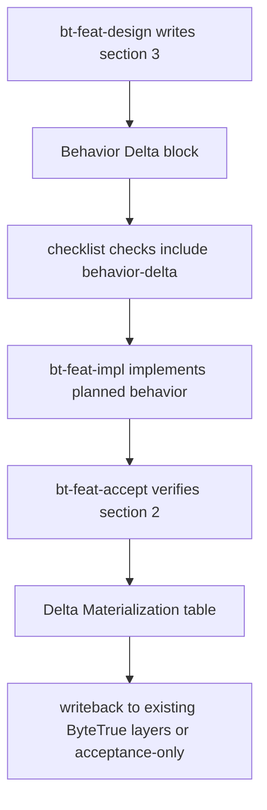

# behavior-delta-contract design

## 0. Terminology

- **Behavior Delta**: a feature-design block that states observable behavior changes as `ADDED`, `MODIFIED`, `REMOVED`, or `RENAMED`. Anti-conflict: it is not a new `.bytetrue/specs/` layer and not a standalone delta file.
- **Delta Materialization**: an acceptance-report block that checks each behavior delta against evidence and records whether it was written back to `requirements/`, `architecture/`, `compound/`, or kept acceptance-only.
- **Writeback target**: the existing ByteTrue layer that should receive a stable accepted outcome. Anti-conflict: design predicts targets, but acceptance performs the actual writeback.
- **Acceptance-only delta**: a behavior delta whose evidence matters for the feature report but is too local to become long-lived requirement or architecture text.

## 1. Decisions and Constraints

### Requirement summary

This feature adds the first OpenSpec-inspired behavior delta contract to ByteTrue's standard feature workflow. A future feature design must be able to declare behavior changes explicitly, and acceptance must be able to verify and materialize those changes without adding a parallel `.bytetrue/specs/` source-of-truth layer.

Success means:

- `bt-feat-design` tells designers where and how to write Behavior Delta.
- `bt-feat-accept` verifies Behavior Delta and records materialization.
- checklist extraction can track behavior-delta checks.
- current project shared conventions and onboard templates stay in sync.

Explicit non-goals:

- do not add `.bytetrue/specs/`;
- do not add standalone `{slug}-delta.md`;
- do not renumber top-level feature design sections;
- do not implement risk modes, context manifests, subagent handoff, breadcrumb, or worklog in this feature;
- do not write behavior deltas directly into requirements or architecture during design.

### Complexity dimensions

This is a workflow-contract and skill-documentation change. It follows the default documentation/workflow bundle except:

- **Public surface = stable**: the changed templates shape future feature designs and acceptance reports.
- **Testing = validation/manual**: no runtime code is added; verification relies on grep, file review, markdown line limits, and YAML validation if generated files change.

### Key decisions

1. **Place Behavior Delta inside design section 3.**
   - Reason: section 3 already owns acceptance-facing behavior scenarios; placing delta there avoids top-level renumbering and keeps acceptance's section mapping stable.
2. **Place Delta Materialization inside acceptance section 2.**
   - Reason: section 2 already verifies behavior and decisions; adding a subsection there preserves the 9-section acceptance template.
3. **Add `behavior-delta` as a checklist source.**
   - Reason: acceptance can only track it reliably if design extracts it into `checks`.
4. **Sync current project conventions and onboard templates together.**
   - Reason: future projects must get the same lifecycle rule, and skill packages cannot share another skill's internal reference file.

## 2. Terms and Orchestration

### 2.1 Term Layer

#### Current state

- `skills/bt-feat-design/reference.md`: defines design sections 0-4 and checklist sources, but has no Behavior Delta section or `behavior-delta` checklist source.
- `skills/bt-feat-design/SKILL.md`: says section 3 is the acceptance contract with scenarios and reverse-checks, but does not require behavior delta.
- `skills/bt-feat-accept/SKILL.md`: acceptance section 2 verifies behavior/decisions and section 3 verifies scenarios, but no section materializes behavior deltas.
- `.bytetrue/reference/shared-conventions.md` and `skills/bt-onboard/reference/shared-conventions.md`: define checklist extraction sources but do not mention behavior delta.
- `.bytetrue/roadmap/ai-workflow-absorption/ai-workflow-absorption-contracts.md`: already defines the desired Behavior Delta and Delta Materialization contract.

#### Change

- Add `### 3.2 Behavior Delta` to the feature-design reference, with `ADDED`, `MODIFIED`, `REMOVED`, and `RENAMED` fields matching the roadmap contract.
- Update `bt-feat-design/SKILL.md` so section 3 reminders include behavior delta and no-behavior-change explicit statement.
- Add `behavior-delta` to checklist source vocabulary and extraction rules in both current shared conventions and onboard template.
- Update `bt-feat-accept/SKILL.md` so section 2 includes `### Behavior Delta Materialization`, evidence, writeback target, and status.

Interface example:

```markdown
### 3.2 Behavior Delta

#### ADDED
- Requirement: Future feature designs can state newly added observable behavior.
- Scenario: GIVEN a feature adds new user-visible behavior WHEN design is approved THEN the behavior is listed as ADDED and later checked by acceptance.
```

```yaml
checks:
  - item: "Behavior Delta ADDED entries have evidence or explicit none"
    source: behavior-delta
    status: pending
```

### 2.2 Orchestration Layer



#### Current state

The current feature workflow already has design → checklist → implement → acceptance. Acceptance writes architecture, requirement, and roadmap state, but the behavior-level change summary is spread across requirement summary, scenario checks, and architecture merge. There is no single list of expected behavior deltas to verify.

#### Change

Insert a behavior-delta lane into the existing flow without changing stage order:

1. design writes Behavior Delta inside section 3;
2. design extracts `behavior-delta` checks into checklist;
3. implementation follows existing steps and does not mark deltas passed;
4. acceptance verifies each delta in section 2 and records materialization;
5. acceptance decides whether each stable result writes back to existing layers or remains acceptance-only.

Flow-level constraints:

- No new top-level source-of-truth directory is introduced.
- Acceptance is the only stage that can mark a delta materialized.
- If design says `Behavior Delta: none`, acceptance must still check that no behavior drift was introduced.
- If acceptance discovers a behavior delta missing from design, it must fix code or backfill design before final report.

### 2.3 Mount-Point Inventory

- `skills/bt-feat-design/reference.md`: add the design template and checklist source for Behavior Delta.
- `skills/bt-feat-design/SKILL.md`: require Behavior Delta during design drafting and exit checks.
- `skills/bt-feat-accept/SKILL.md`: add Delta Materialization to the acceptance report template and verification rhythm.
- `.bytetrue/reference/shared-conventions.md`: update current project checklist extraction vocabulary.
- `skills/bt-onboard/reference/shared-conventions.md`: update onboard template so new projects receive the same rule.

### 2.4 Rollout Strategy

1. **Design template contract**: update `bt-feat-design/reference.md` and SKILL reminders.
   - exit signal: a future design can locate `### 3.2 Behavior Delta` and knows when to write `none`.
2. **Checklist extraction**: add `behavior-delta` source to current and onboard shared conventions.
   - exit signal: checklist source vocabulary includes behavior-delta in both copies.
3. **Acceptance materialization**: update `bt-feat-accept/SKILL.md` section 2 template and startup/exit checks.
   - exit signal: acceptance report template contains `Behavior Delta Materialization` without changing 9 top-level sections.
4. **Smoke validation**: grep and line-limit validation.
   - exit signal: behavior delta terms appear only in intended files, all edited md files stay under 300 lines, and roadmap item state is in-progress after approval.

### 2.5 Structural Health and Micro-refactor

##### Evaluation

- file level — `skills/bt-feat-design/SKILL.md`: 261 lines; single-purpose workflow guide; small additive reminders only.
- file level — `skills/bt-feat-design/reference.md`: 256 lines; near the 300-line project limit, so implementation must keep additions concise.
- file level — `skills/bt-feat-accept/SKILL.md`: 255 lines; acceptance template is dense but still single-purpose.
- file level — `.bytetrue/reference/shared-conventions.md`: 275 lines; near limit, only concise checklist vocabulary update is allowed.
- file level — `skills/bt-onboard/reference/shared-conventions.md`: 275 lines; must mirror the concise current-project update.
- directory level — `skills/bt-feat-design/` and `skills/bt-feat-accept/`: small directories, not flattened.
- directory level — `.bytetrue/reference/` and `skills/bt-onboard/reference/`: reference directories contain multiple files but this feature modifies existing files only.

##### Conclusion: do not refactor

No micro-refactor is needed. The touched files are already the owning artifacts for the contract. The implementation constraint is line budget: if a file would exceed 300 lines, compress wording rather than splitting in this feature. A broader reference-doc split is out of scope.

## 3. Acceptance Contract

Key scenarios:

1. **Design template**: opening `skills/bt-feat-design/reference.md` → expected result: `### 3.2 Behavior Delta` exists and documents ADDED/MODIFIED/REMOVED/RENAMED plus `none` behavior.
2. **Design workflow**: reading `skills/bt-feat-design/SKILL.md` → expected result: section 3 reminders require behavior delta or explicit no-behavior-change statement.
3. **Checklist extraction**: reading both shared-conventions copies → expected result: `behavior-delta` is a valid checklist source and extraction target.
4. **Acceptance template**: reading `skills/bt-feat-accept/SKILL.md` → expected result: section 2 includes Behavior Delta Materialization with Delta/Evidence/Writeback target/Status.
5. **No source-of-truth drift**: grep for `.bytetrue/specs` in changed guidance → expected result: no instruction creates or targets that directory.
6. **Line budget**: `wc -l` on edited markdown files → expected result: each remains ≤300 lines.

Reverse-check items for explicit non-goals:

- no standalone `{slug}-delta.md` path is introduced;
- no top-level design section renumbering is introduced;
- no hook, context manifest, subagent, risk mode, or worklog contract is implemented in this feature;
- no design-stage instruction writes directly to requirements or architecture.

### 3.1 Test Seam / TDD Plan

- **TDD applicability**: not applicable as strict TDD. This is a documentation/workflow-contract feature with no runtime logic.
- **Highest behavior seam**: generated future feature design and acceptance template behavior, validated by reading/grep.
- **Priority red/green behaviors**:
  1. grep before implementation should show no Behavior Delta contract in feature-design/acceptance guidance; after implementation it should appear in intended files;
  2. checklist source vocabulary should gain `behavior-delta`;
  3. edited markdown files should stay under 300 lines.
- **Manual verification items**: review the template wording against roadmap contract and confirm no `.bytetrue/specs` source-of-truth is introduced.

## 4. Relationship with Project-Level Architecture Docs

This feature changes ByteTrue workflow architecture: the feature workflow gains a behavior-delta lane between design and acceptance. Acceptance should update `.bytetrue/architecture/ARCHITECTURE.md` after implementation so future readers can see that feature design now carries behavior deltas and acceptance materializes them into existing ByteTrue layers.

Architecture merge candidate:

- add a key architecture decision or workflow note: “Feature design may declare Behavior Delta; feature acceptance materializes those deltas into existing requirements/architecture/compound layers or marks them acceptance-only. ByteTrue does not maintain a separate `.bytetrue/specs/` layer.”
