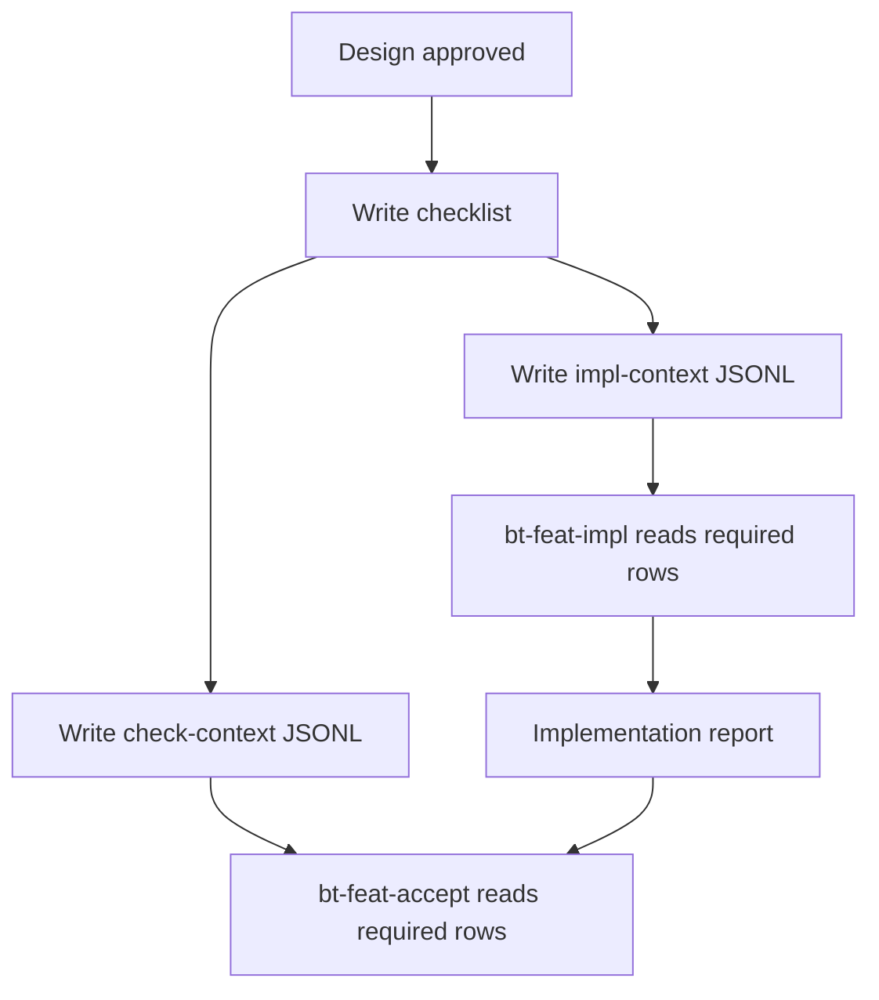

# context-manifest-contract design

## 0. Terminology

- **Context Manifest**: a feature-local JSONL file that lists project facts and evidence a later stage must read. Anti-conflict: it is not a new source of truth and does not replace design or checklist.
- **Implementation Context Manifest**: `{slug}-impl-context.jsonl`, consumed by `bt-feat-impl`. Anti-conflict: it is not an implementation plan and should not list raw code files by default.
- **Check Context Manifest**: `{slug}-check-context.jsonl`, consumed by `bt-feat-accept` and future check roles. Anti-conflict: it is not an acceptance report and does not prove anything by itself.
- **Manifest Row**: one JSON object with `file`, `reason`, and optional `required`, `section`, `role`. Anti-conflict: seed examples without a real `file` are not live rows.

## 1. Decisions and Constraints

### Requirement summary

This feature adds the first ByteTrue context manifest contract. When a standard feature design is approved, design should create two feature-local JSONL manifests:

```text
.bytetrue/features/YYYY-MM-DD-{slug}/
├── {slug}-impl-context.jsonl
└── {slug}-check-context.jsonl
```

Success means:

- `.bytetrue/reference/context-manifest.md` and the onboard template define row shape and lifecycle;
- `bt-feat-design` creates the two manifests after checklist generation for new approved standard designs;
- `bt-feat-impl` reads `impl-context` and blocks missing required files for new features;
- `bt-feat-accept` reads `check-context` and blocks missing required files for new features;
- `bt-onboard` releases the shared reference;
- no subagent dispatch, hook, breadcrumb, research-first routing, worklog, or new CLI is implemented.

Explicit non-goals:

- do not dispatch subagents or write subagent prompts;
- do not implement workflow-state breadcrumb or hooks;
- do not implement research-first routing;
- do not create a context resolver script or CLI;
- do not list raw source code files as default manifest rows;
- do not store duplicated excerpts of referenced docs inside the manifest.

### Complexity dimensions

This is a workflow-contract and artifact-shape change. It follows the internal workflow/tooling default bundle. Deviations:

- **Public surface = stable**: future feature directories gain two optional-but-expected artifacts.
- **Persistence = local docs**: JSONL files live next to design/checklist, not under a global state directory.
- **Testability = static validation**: verify with grep, JSONL smoke parsing, YAML validation, line counts, and manual consistency.

### Execution mode

```yaml
execution_mode:
  level: standard
  triggers: [normal-feature, workflow-contract]
  required_evidence: [manual-check, impact-surface-check, lint-or-typecheck, spec-compliance-review, code-quality-review]
```

Rationale: this affects multiple workflow stages and future subagent readiness, but adds no runtime system or high-risk business logic. Strict TDD is not applicable.

### Key decisions

1. **Use two files, not one combined manifest.**
   - Reason: implement and check roles need different context. Mixing them makes future subagent handoff less precise.
2. **Use JSONL, not YAML checklist extension.**
   - Reason: JSONL rows are append-friendly, easy to stream, and Trellis already proved the shape. Checklist remains action/status; manifest remains context/read-set.
3. **Put the contract in `context-manifest.md`.**
   - Reason: near-limit skill files should only point to the contract.
4. **Default rows reference `.bytetrue` docs and evidence, not raw code.**
   - Reason: implement/check agents should discover code as needed; manifests curate durable project facts and constraints.
5. **Legacy features without manifests remain readable.**
   - Reason: this feature is additive. New designs after this feature should create manifests, but old feature dirs should not be invalidated.

## 2. Terms and Orchestration

### 2.1 Term Layer

#### Current state

- `ai-workflow-absorption-contracts.md` defines the target row shape and the two files, but no live shared reference exists.
- `bt-feat-design` currently writes design and checklist only.
- `bt-feat-impl` reads design, checklist, attention, execution modes, and implementation review, but has no feature-local read-set file.
- `bt-feat-accept` reads design, checklist, architecture docs, git diff/log, and implementation review evidence, but has no feature-local check read-set file.
- No `*-impl-context.jsonl` or `*-check-context.jsonl` files exist under `.bytetrue/features/` yet.

#### Change

Add shared reference contracts:

```text
.bytetrue/reference/context-manifest.md
skills/bt-onboard/reference/context-manifest.md
```

Manifest row shape:

```typescript
type ByteTrueContextManifestRow = {
  file: string;        // repo-relative path
  reason: string;      // why this context is needed
  required?: boolean;  // default true
  section?: string;    // optional human hint
  role?: "implement" | "check" | "both";
}
```

Example rows:

```json
{"file":".bytetrue/roadmap/ai-workflow-absorption/ai-workflow-absorption-contracts.md","reason":"Roadmap contract is a hard constraint for this feature.","required":true,"role":"both"}
{"file":".bytetrue/reference/implementation-review.md","reason":"Implementation completion must report readiness gate evidence.","required":true,"role":"check"}
```

### 2.2 Orchestration Layer



#### Current state

The workflow depends on each stage rediscovering context from skill instructions. This works in a single main session but becomes weaker across long sessions, handoff, or future subagents.

#### Change

- `bt-feat-design` creates both manifests after checklist generation and before exit.
- `impl-context` starts with design, checklist, requirement if present, roadmap docs if present, architecture docs named in section 4, execution modes, implementation review, and relevant compound evidence explicitly cited in design.
- `check-context` starts with design, checklist, acceptance contract, behavior delta, roadmap docs if present, implementation review, architecture docs to merge, and relevant decisions/explore evidence.
- `bt-feat-impl` reads `impl-context` during startup. For new features, a missing required file blocks implementation until design fixes the manifest or the user explicitly downgrades the row.
- `bt-feat-accept` reads `check-context` during startup. Missing required files block acceptance the same way.

Flow-level constraints:

- Manifest files contain paths and reasons only, not copied document bodies.
- Required rows default to `true` when omitted.
- Optional rows may be skipped if absent, but the skip should be mentioned in the stage report when relevant.
- If a manifest row points outside the repo or to a missing file, the stage must stop unless the user confirms it is optional or stale.
- Manifest validation is static: each non-empty line must parse as JSON and include `file` and `reason`.

### 2.3 Mount-Point Inventory

- `.bytetrue/reference/context-manifest.md`: add current shared context manifest contract.
- `skills/bt-onboard/reference/context-manifest.md`: add onboard template copy.
- `skills/bt-feat-design/SKILL.md` and `reference.md`: create manifests after checklist generation and include them in exit conditions.
- `skills/bt-feat-impl/SKILL.md`: startup reads `impl-context` and handles missing required files.
- `skills/bt-feat-accept/SKILL.md`: startup reads `check-context` and handles missing required files.
- `skills/bt-onboard/SKILL.md`, current/onboard `system-overview.md`: list the new reference file.

### 2.4 Rollout Strategy

1. **Shared contract**: add current/onboard `context-manifest.md`.
   - exit signal: both copies define row shape, file naming, required-row semantics, and JSONL validation.
2. **Design generation**: update `bt-feat-design` to create manifests after checklist generation.
   - exit signal: future approved designs produce both JSONL files with required baseline rows.
3. **Implementation and acceptance consumption**: update `bt-feat-impl` and `bt-feat-accept` startup rules.
   - exit signal: each stage reads its matching manifest and blocks missing required files for new features.
4. **Onboard/index sync and validation**: update onboard inventory and references; run YAML, JSONL smoke checks, and line counts.
   - exit signal: touched markdown files stay under 300 lines, YAML validates, and sample manifest rows parse.

### 2.5 Structural Health and Micro-refactor

##### Evaluation

- file level — `skills/bt-feat-design/SKILL.md`: 264 lines, near limit; add only concise lifecycle instruction.
- file level — `skills/bt-feat-design/reference.md`: 260 lines, near limit; add compact manifest format / extraction notes only.
- file level — `skills/bt-feat-impl/SKILL.md`: 240 lines, safe for a short startup rule.
- file level — `skills/bt-feat-accept/SKILL.md`: 262 lines, near limit; add only a compact startup rule.
- file level — `skills/bt-onboard/SKILL.md`: 248 lines, near limit; inventory-only update.
- directory level — `.bytetrue/reference/`: 10 files, but these are named shared references and one more focused contract matches the established pattern.
- directory level — `skills/bt-onboard/reference/`: mirrors current reference; adding one template copy matches existing ownership.
- compound convention search: no active directory/naming convention hit for context manifest ownership.

##### Conclusion: do not refactor

No micro-refactor is needed. The detailed manifest contract belongs in `context-manifest.md`; skill files should only point to it and state stage-specific responsibilities.

## 3. Acceptance Contract

Key scenarios:

1. **Shared contract exists**: opening current and onboard `context-manifest.md` → both define JSONL file names, row shape, required semantics, and validation rules.
2. **Design produces manifests**: reading `bt-feat-design` → approved standard designs create `{slug}-impl-context.jsonl` and `{slug}-check-context.jsonl` after checklist generation.
3. **Implementation reads manifest**: reading `bt-feat-impl` → startup includes `impl-context`; missing required rows block new-feature implementation.
4. **Acceptance reads manifest**: reading `bt-feat-accept` → startup includes `check-context`; missing required rows block new-feature acceptance.
5. **Onboard releases reference**: `bt-onboard` inventory and system overview include `context-manifest.md`.
6. **No future features implemented early**: grep → no subagent dispatch, hook/breadcrumb, research-first routing, worklog, or CLI behavior introduced.
7. **Line budget and file validity**: all edited markdown files stay ≤300 lines; YAML validates; sample JSONL rows parse.

Reverse-check items:

- no raw code files are required as default manifest rows;
- no instruction treats manifest contents as copied context or a source of truth;
- no instruction says missing required files can be ignored silently;
- no subagent prompt protocol is introduced in this feature.

### 3.1 Test Seam / TDD Plan

- **TDD applicability**: not strict TDD. This is a documentation/workflow-artifact feature with no runtime logic.
- **Highest behavior seam**: future `bt-feat-design` closeout and `bt-feat-impl` / `bt-feat-accept` startup checks.
- **Priority red/green behaviors**:
  1. before implementation, no `context-manifest.md` and no design rule for manifest generation; after implementation, both exist;
  2. implementation startup names `impl-context` and required-row blocking;
  3. acceptance startup names `check-context` and required-row blocking.
- **Manual verification items**: grep mount points, static parse sample JSONL rows, validate YAML, check line counts, confirm no subagent/hook/worklog behavior.

### 3.2 Behavior Delta

#### ADDED

- Requirement: ByteTrue feature design produces explicit implement/check context manifests for later stages.
- Scenario: GIVEN a standard feature design is approved WHEN checklist generation is complete THEN the feature directory contains `{slug}-impl-context.jsonl` and `{slug}-check-context.jsonl` with required context rows.

#### MODIFIED

- Source: existing `bt-feat-impl` and `bt-feat-accept` startup context rules.
- Before: stages infer required context from skill text and current session state.
- After: stages read feature-local context manifests and block missing required files for new features.

## 4. Relationship with Project-Level Architecture Docs

This feature changes ByteTrue workflow architecture by introducing feature-local context manifests as the handoff surface between design, implementation, acceptance, and future subagent roles.

Acceptance should update `.bytetrue/architecture/ARCHITECTURE.md` to state that context manifests are local feature artifacts, not a new facts layer. Requirement `context-manifest-contract` should become current after implementation lands.
