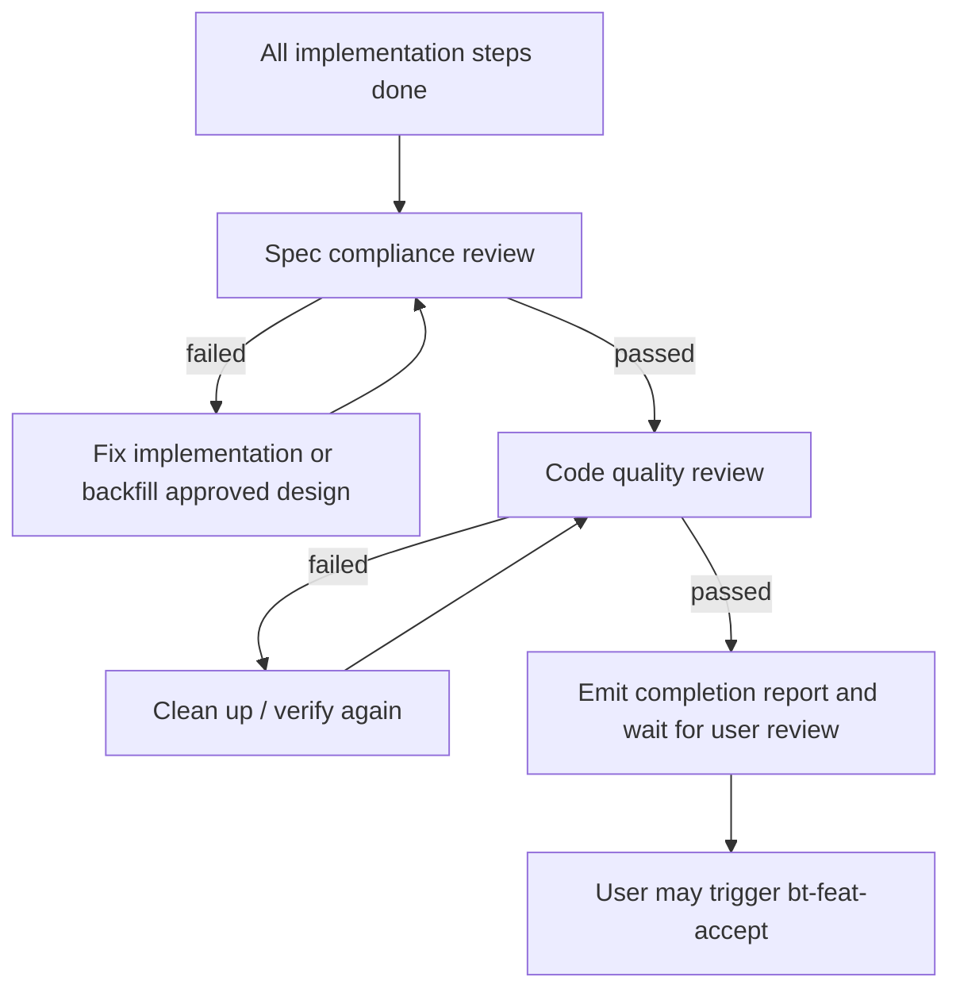

# implementation-review-gate design

## 0. Terminology

- **Implementation Review Gate**: the mandatory review moment after all implementation steps are done and before acceptance starts. Anti-conflict: this is not `bt-feat-accept`; acceptance still independently verifies and writes back docs.
- **Spec Compliance Review**: checks whether the implementation matches the approved design: behavior deltas, scenarios, non-goals, and no extra behavior. Anti-conflict: it is not code style review.
- **Code Quality Review**: checks whether the implementation is clean enough to hand to acceptance: fresh verification, no debug/temp code, no unplanned refactor, reflection checks handled, naming/module boundaries consistent. Anti-conflict: it cannot pass if spec compliance failed.
- **Inline Review**: the main agent performs the two review dimensions itself. Anti-conflict: subagent review is optional future enhancement, not required in this feature.

## 1. Decisions and Constraints

### Requirement summary

This feature adds the first ByteTrue implementation review gate. After `bt-feat-impl` finishes checklist steps, it must review the implementation in two ordered dimensions before it can tell the user to proceed to `bt-feat-accept`:

1. spec compliance first;
2. code quality second.

Success means:

- `.bytetrue/reference/implementation-review.md` and the onboard template define the gate;
- `bt-feat-impl` completion report includes an `Implementation Review Gate` section;
- `bt-feat-accept` startup checks verify that implementation review evidence exists;
- execution mode evidence vocabulary includes `spec-compliance-review` and `code-quality-review`;
- no subagent, manifest, hook, or worklog behavior is implemented early.

Explicit non-goals:

- do not implement subagent review dispatch;
- do not implement context manifests;
- do not make acceptance optional or weaker;
- do not add a new CLI/runtime hook;
- do not turn this into a generic code-review framework outside ByteTrue feature flow.

### Complexity dimensions

This is a workflow-contract change. It follows the internal workflow/tooling default bundle. Deviations:

- **Public surface = stable**: future feature implementation and acceptance behavior changes.
- **Testability = verified by docs/checks**: no runtime code; evidence comes from grep, YAML validation, size counts, and consistency review.

### Execution mode

```yaml
execution_mode:
  level: standard
  triggers: [normal-feature, workflow-contract]
  required_evidence: [manual-check, impact-surface-check, lint-or-typecheck]
```

Rationale: this changes cross-workflow instructions but adds no runtime behavior or complex business logic. Strict TDD is not applicable; acceptance must still use fresh grep/manual evidence.

### Key decisions

1. **Create `implementation-review.md` instead of embedding the full checklist in skill files.**
   - Reason: `bt-feat-impl` and `bt-feat-accept` are near the 300-volume control; a focused reference is easier to reuse and onboard.
2. **Spec compliance runs before code quality.**
   - Reason: clean code that implements the wrong behavior is still a failed implementation.
3. **Acceptance checks for review evidence but does not trust it blindly.**
   - Reason: implementation review is a gate into acceptance, not a replacement for acceptance.
4. **Subagent review remains future enhancement.**
   - Reason: the first version must work in every Skill-capable tool, including those without subagents.

## 2. Terms and Orchestration

### 2.1 Term Layer

#### Current state

- `ai-workflow-absorption-contracts.md`: already defines `implementation_review` shape with `spec_compliance` and `code_quality` blocks.
- `skills/bt-feat-impl/SKILL.md`: fixed completion report includes changed files, plan-external changes, reflection self-audit, rollout verification, acceptance-scenario self-check, and TDD evidence, but no named two-stage review gate.
- `skills/bt-feat-accept/SKILL.md`: startup checks require implementation evidence in general, but do not require implementation review gate evidence.
- `.bytetrue/reference/execution-modes.md`: evidence vocabulary does not yet include `spec-compliance-review` or `code-quality-review`.

#### Change

Add shared reference contracts:

```text
.bytetrue/reference/implementation-review.md
skills/bt-onboard/reference/implementation-review.md
```

Core shape:

```yaml
implementation_review:
  spec_compliance:
    status: passed | failed
    evidence: []
  code_quality:
    status: passed | failed
    evidence: []
```

Add two evidence vocabulary items to execution modes:

- `spec-compliance-review`
- `code-quality-review`

Interface example inside implementation completion report:

```markdown
### Implementation Review Gate

**Spec compliance**: passed / failed
- behavior deltas satisfied: ...
- acceptance scenarios have evidence: ...
- no extra behavior outside design: ...
- explicit non-goals guarded: ...

**Code quality**: passed / failed
- fresh verification: ...
- no debug/temp code: ...
- no unplanned refactor: ...
- reflection checks handled: ...
```

### 2.2 Orchestration Layer



#### Current state

Implementation already stops after a completion report and waits for user review, but the report spreads review concerns across multiple sections. The pitfall list already says not to enter acceptance before implementation review, but there is no explicit template section that proves the review happened.

#### Change

- `bt-feat-impl` reads `.bytetrue/reference/implementation-review.md` and runs the gate after checklist steps are done.
- Completion report gains `### Implementation Review Gate` before acceptance-scenario self-check or directly before TDD evidence.
- `bt-feat-accept` startup checks verify the implementation report includes both gate dimensions; missing evidence sends the feature back to implementation.
- `execution-modes.md` includes the two review evidence names so strict-evidence designs can require them.

Flow-level constraints:

- Spec compliance must pass before code quality is meaningful.
- If spec compliance fails because the design is wrong, implementation must stop and route back to design rather than patching silently.
- Code quality review cannot approve unplanned refactors, debug/temp code, or stale verification.
- Inline review is mandatory; subagent review is optional later.

### 2.3 Mount-Point Inventory

- `.bytetrue/reference/implementation-review.md`: add current project shared review contract.
- `skills/bt-onboard/reference/implementation-review.md`: add onboard template copy.
- `.bytetrue/reference/execution-modes.md` and onboard copy: add review evidence vocabulary.
- `skills/bt-onboard/SKILL.md`: add implementation-review reference to skeleton and managed-file list.
- `.bytetrue/reference/system-overview.md` and onboard copy: add reference index entry.
- `skills/bt-feat-impl/SKILL.md`: add review gate read requirement and report section.
- `skills/bt-feat-accept/SKILL.md`: add startup check / verification rhythm for implementation review evidence.

### 2.4 Rollout Strategy

1. **Shared contract**: add current/onboard `implementation-review.md` plus execution-mode evidence items.
   - exit signal: both reference copies define spec compliance and code quality gates, and execution mode vocab includes both review evidence names.
2. **Implementation integration**: update `bt-feat-impl` to read the contract and include `Implementation Review Gate` in the completion report.
   - exit signal: future implementation reports must state spec compliance and code quality separately.
3. **Acceptance integration**: update `bt-feat-accept` startup / verification guidance to require review evidence before acceptance proceeds.
   - exit signal: acceptance sends missing implementation-review evidence back to implementation.
4. **Onboard/index sync and validation**: update onboard inventory and system overview references; validate YAML and size counts.
   - exit signal: touched checklist validates.

### 2.5 Structural Health and Micro-refactor

##### Evaluation

- file level — `skills/bt-feat-impl/SKILL.md`: originally assessed as healthy but should receive only a concise pointer and report section.
- file level — `skills/bt-feat-accept/SKILL.md`: close to maintainer guidance; avoid embedding the full review checklist.
- file level — `skills/bt-onboard/SKILL.md`: close to maintainer guidance; only inventory mentions.
- file level — `.bytetrue/reference/execution-modes.md`: originally assessed as safe for two evidence vocabulary entries.
- directory level — `.bytetrue/reference/` and `skills/bt-onboard/reference/`: already contain shared reference docs; adding one focused contract follows the same pattern.

##### Conclusion: do not refactor

No micro-refactor is needed. The detailed review table should live in `implementation-review.md`; workflow skill files should only point to it and state their stage-specific responsibilities.

## 3. Acceptance Contract

Key scenarios:

1. **Shared contract exists**: opening current and onboard `implementation-review.md` → both define spec compliance and code quality gates.
2. **Implementation report includes gate**: reading `bt-feat-impl` → completion report requires an `Implementation Review Gate` section with both dimensions.
3. **Acceptance checks gate evidence**: reading `bt-feat-accept` → startup / verification rules send missing gate evidence back to implementation.
4. **Execution mode vocabulary includes review evidence**: reading current and onboard `execution-modes.md` → both include `spec-compliance-review` and `code-quality-review`.
5. **No subagent/manifest behavior**: grep → no subagent dispatch, context manifest, hook, or worklog behavior is introduced.
6. **Conciseness check**: edited documents stay concise.

Reverse-check items:

- no instruction says subagents are required;
- no instruction says acceptance can trust implementation review without checking;
- no context manifest files are created;
- no new CLI/runtime state file is created.

### 3.1 Test Seam / TDD Plan

- **TDD applicability**: not strict TDD. This is a documentation/workflow-contract feature.
- **Highest behavior seam**: future `bt-feat-impl` completion report and `bt-feat-accept` startup checks.
- **Priority red/green behaviors**:
  1. before implementation, no `implementation-review.md` exists; after implementation, current/onboard copies exist;
  2. implementation completion report template includes two review dimensions;
  3. acceptance startup/verification requires implementation review evidence.
- **Manual verification items**: grep mount points, validate YAML, size counts, confirm no subagent/manifest behavior was introduced.

### 3.2 Behavior Delta

#### ADDED

- Requirement: ByteTrue feature implementation has a named review gate before acceptance.
- Scenario: GIVEN all implementation checklist steps are done WHEN the implementation completion report is produced THEN it separately reports spec compliance and code quality review results.

#### MODIFIED

- Source: existing `bt-feat-impl` completion report and `bt-feat-accept` startup checks.
- Before: review concerns are spread across reflection and scenario self-checks without a named gate.
- After: `Implementation Review Gate` is explicit, and acceptance requires evidence that it ran.

## 4. Relationship with Project-Level Architecture Docs

This feature changes ByteTrue workflow architecture: feature implementation now has an explicit pre-acceptance review gate with ordered spec compliance and code quality dimensions.

Acceptance should update `.bytetrue/architecture/ARCHITECTURE.md` to state that implementation review gates acceptance readiness but does not replace acceptance. Requirement `implementation-review-gate` should become current after implementation lands.
