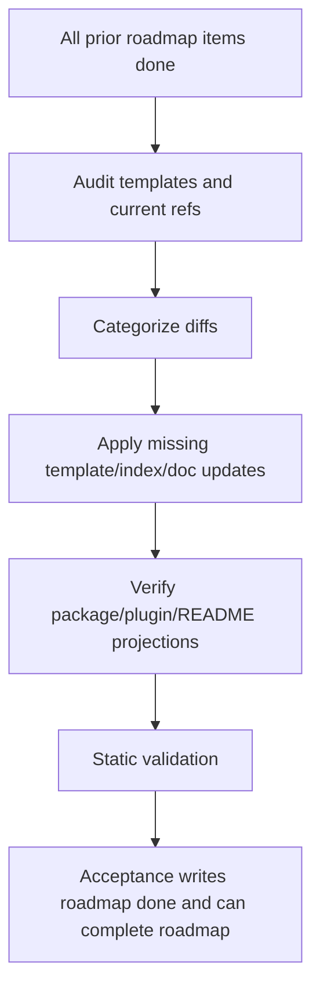

# onboard-template-rollout design

## 0. Terminology

- **Template Rollout**: the final distribution pass that makes already accepted workflow contracts available to new projects through `bt-onboard`. Anti-conflict: it is not a new workflow capability.
- **Skill-package-managed Reference**: a reference file that `bt-onboard` may refresh from `skills/bt-onboard/reference/`. Anti-conflict: project-owned config is excluded.
- **Project-owned Reference**: current project configuration such as `domain-context.md` and `project-management.md`. Anti-conflict: rollout must not overwrite these without confirmation.
- **Install Projection**: package/plugin metadata and README instructions that expose ByteTrue to Pi, Claude Code, and Agent Skills users. Anti-conflict: this feature does not publish releases.
- **Reference Parity Audit**: comparison between current `.bytetrue/reference/` and `skills/bt-onboard/reference/` filenames and selected content. Anti-conflict: parity does not mean byte-for-byte equality for project-owned files.

## 1. Decisions and Constraints

### Requirement summary

This feature performs the final `ai-workflow-absorption` distribution pass. It audits and synchronizes onboard templates, current shared references, README/install guidance, and package/plugin projection so that the eight completed sub-features are available to future projects without re-running their individual feature flows.

Success means:

- `bt-onboard` skeleton and managed-reference list include every new reference and `.bytetrue/worklog/`;
- current `.bytetrue/reference/` and onboard template references have the same file set, with intentional project-owned exceptions documented;
- README describes the Pi package as skills-only, not skills-only;
- package/plugin metadata still validates and lists the correct install projections;
- roadmap `onboard-template-rollout` is later accepted as done and the whole roadmap is ready to complete once all items are done;
- no new workflow contract, runtime feature, tracker sync, release publish, or external push is performed.

Explicit non-goals:

- do not redesign behavior delta, execution modes, implementation review, context manifest, subagent handoff, research-first, or worklog contracts;
- do not overwrite `domain-context.md` or `project-management.md` project content;
- do not publish package/plugin releases or run external marketplace commands;
- do not change skill descriptions unless the rollout audit finds a direct mismatch;
- do not add a new CLI or new runtime behavior.

### Complexity dimensions

This is documentation / template integration. Deviations:

- **Impact surface = repository distribution layer**: touches README, package/plugin metadata if needed, `bt-onboard`, template references, and current reference indexes.
- **Risk = consistency drift**: main risk is forgetting a reference or incorrectly treating project-owned config as managed.
- **Verification = static audit**: validate JSON/YAML, file set parity, size counts, grep for expected references, and README install text.

### Execution mode

```yaml
execution_mode:
  level: standard
  triggers: [workflow-contract, template-rollout]
  required_evidence: [manual-check, spec-compliance-review, code-quality-review]
```

TDD is not suitable; this is a documentation/template rollout feature.

### Key decisions

1. **Do a parity audit, not blind copy.**
   - Reason: some current reference files are project-owned or localized and should intentionally differ from onboard templates.
2. **README gets the minimum install-projection update.**
   - Reason: package should remain skills-only; runtime adapters are deferred.
3. **Do not expand this into a release process.**
   - Reason: publishing tags/npm/marketplace belongs outside this feature and requires explicit user approval.
4. **Mark current/onboard reference mismatches with categories.**
   - Reason: future maintainers need to know which diffs are expected and which indicate drift.
5. **Keep changes additive and surgical.**
   - Reason: this is final integration, not another method absorption feature.

## 2. Terms and Orchestration

### 2.1 Term Layer

#### Current state

- `bt-onboard` already lists the new references through `worklog-report-feed`, including `.bytetrue/worklog/`.
- Current and onboard reference directories currently have the same `.md` filename set, but some files differ by design or project ownership.
- README still says the Pi package install path and should keep the core package skills-only.
- `package.json` registers `pi.skills` and does not register `pi.extensions`; Claude plugin metadata is metadata-only and should remain valid.
- Root README badge says 28 skills, and the repo currently has 28 `SKILL.md` files.

#### Change

Add or update a maintainer-facing rollout note, likely in current and onboard `maintainer-notes.md`, documenting:

```text
Reference parity audit categories:
- managed identical: should match current/onboard exactly
- managed localized/current-specific: may differ but must preserve same contract
- project-owned: do not overwrite without confirmation
```

Update README install section to state:

```text
Pi package installs ByteTrue skills only; runtime adapters are deferred outside core.
Tools that only support Agent Skills can still install the skills-only bundle through npx skills add.
```

Run static checks:

```text
- package.json parses, `pi.skills` exists, and `pi.extensions` is absent
- .claude-plugin/*.json parse
- find skills -maxdepth 2 -name SKILL.md count matches README badge
- current/onboard reference filename sets match
- expected new references are indexed in system-overview and bt-onboard
```

### 2.2 Orchestration Layer



#### Current state

The previous eight features have individually updated their current and onboard references. There is no final one-pass audit that proves new projects get the complete integrated workflow.

#### Change

- Perform reference filename parity check between `.bytetrue/reference/` and `skills/bt-onboard/reference/`.
- Confirm every new shared reference is in `bt-onboard` inventory and current/onboard system overview.
- Update README Pi install text to mention runtime adapters are deferred.
- If plugin metadata remains valid and unchanged, record that no plugin metadata edit is needed.
- If package metadata registers runtime extensions, remove them unless a separate runtime-adapter feature explicitly owns them.
- Acceptance later should mark the roadmap item done; if all roadmap items are done, note that roadmap can be marked done.

Flow-level constraints:

- Do not overwrite project-owned `domain-context.md` and `project-management.md`.
- Do not force byte equality on localized/current-specific docs such as Chinese current `system-overview.md` vs English onboard template.
- Do not add new runtime behavior.
- Do not publish, push, or tag.
- Keep markdown files concise.

### 2.3 Mount-Point Inventory

- `README.md`: installation / Pi package description update.
- `package.json`: verify `pi.skills` exists and `pi.extensions` is absent; edit only if drift is found.
- `.claude-plugin/plugin.json` and `.claude-plugin/marketplace.json`: verify valid; edit only if metadata drift is found.
- `skills/bt-onboard/SKILL.md`: verify skeleton and managed reference list; edit only if missing entries are found.
- `skills/bt-onboard/reference/maintainer-notes.md` and `.bytetrue/reference/maintainer-notes.md`: add reference parity / rollout maintenance note if missing.
- `.bytetrue/reference/system-overview.md` and onboard copy: verify indexes include all new references.
- `.bytetrue/roadmap/ai-workflow-absorption/`: roadmap state will be updated in acceptance, not implementation.

### 2.4 Rollout Strategy

1. **Reference parity audit**: compare current/onboard reference filename sets and classify content differences.
   - exit signal: parity report is available in implementation report and any missing files are resolved.
2. **Install projection update**: verify package/plugin metadata and update README install wording.
   - exit signal: JSON parses, README mentions pure-skills Pi package, skill count stays correct.
3. **Onboard maintenance note**: update maintainer notes or onboard reference guidance for future parity checks.
   - exit signal: maintainers can tell managed vs project-owned reference differences.
4. **Validation**: run YAML/JSON/line-count/grep checks and no-release scope guard.
   - exit signal: no publish/push/tag/CLI/runtime behavior added, and all files stay concise.

### 2.5 Structural Health and Micro-refactor

##### Evaluation

- file level — `README.md`: originally assessed as safe for a small install wording update.
- file level — `skills/bt-onboard/SKILL.md`: close to maintainer guidance; only audit-driven minimal edits allowed.
- file level — `maintainer-notes.md`: originally assessed as safe for one short section.
- file level — `package.json` and plugin JSON files: small; safe to validate or minimally edit.
- directory level — no new directories planned; only feature artifacts are new.
- compound convention search: no relevant convention blocks this final rollout.

##### Conclusion: do not refactor

No micro-refactor is needed. This is a small integration pass; avoid restructuring README or onboard docs.

## 3. Acceptance Contract

Key scenarios:

1. **Reference filename parity**: current and onboard reference `.md` filename sets match, with project-owned exceptions documented.
2. **New references indexed**: execution modes, implementation review, context manifest, subagent handoff, research-first, and worklog are listed in `bt-onboard` and system overview references.
3. **Worklog directory included**: `bt-onboard` creates `.bytetrue/worklog/.gitkeep`.
4. **Install projection accurate**: `package.json` validates, `pi.skills` is present, `pi.extensions` is absent, Claude plugin metadata validates, and README does not claim a runtime extension.
5. **Skill count accurate**: README skill badge count matches actual `SKILL.md` count.
6. **No release side effects**: no publish, tag, push, external tracker, or marketplace command is run.
7. **No new workflow behavior**: this feature only synchronizes templates, references, README, and metadata.

Reverse-check items:

- no project-owned reference is overwritten;
- no `.bytetrue/specs/` or new source-of-truth layer is introduced;
- no CLI or additional runtime feature is added;
- no README claim says Claude hooks are implemented.

### 3.1 Test Seam / TDD Plan

- **TDD applicability**: not applicable; static documentation/template rollout.
- **Highest behavior seam**: static audit commands and grep evidence.
- **Manual verification items**: file-set parity, JSON parse, README skill count, size counts, no-release scope guard.

### 3.2 Behavior Delta

#### ADDED

- Requirement: ByteTrue has a final rollout pass proving new onboarded projects receive the integrated AI workflow absorption references and directories.
- Scenario: GIVEN a new project runs `bt-onboard` WHEN skeleton references are copied THEN the project receives the full shared workflow reference set through worklog/report-feed.

#### MODIFIED

- Source: README and onboard maintenance guidance.
- Before: install docs describe Pi package install but do not call out runtime adapters are deferred; maintenance docs do not explain reference parity categories.
- After: install docs and maintainer notes describe the integrated package/reference state accurately.

## 4. Relationship with Project-Level Architecture Docs

This feature does not add a new workflow mechanism. It finalizes distribution of existing mechanisms. Acceptance should update architecture only if package/install projection or template ownership becomes a stable current-state fact not already captured. Requirement `onboard-template-rollout` should become current after implementation lands.
