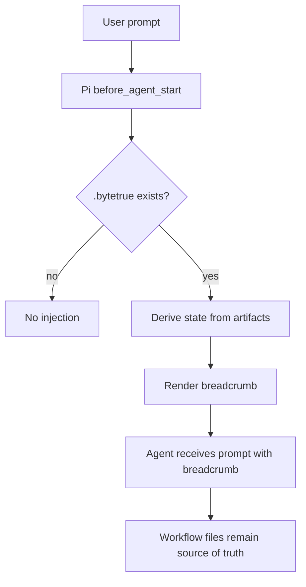

# optional-runtime-breadcrumb design

## 0. Terminology

- **Workflow-state Breadcrumb**: a compact prompt block derived from existing `.bytetrue` artifacts, showing mode, active artifact, status, next action, and guardrails. Anti-conflict: it is not a source of truth.
- **Breadcrumb Resolver**: logic that reads existing feature / roadmap artifacts and derives a best-effort state. Anti-conflict: it must not write state.
- **Optional Runtime Layer**: a harness-specific enhancement that may inject the breadcrumb. Anti-conflict: core ByteTrue skills cannot depend on it.
- **Pi Breadcrumb Extension**: the first concrete optional runtime implementation, loaded through the Pi package. Anti-conflict: it is not a standalone CLI and not a subagent dispatcher.
- **Manual Breadcrumb Contract**: the same rendered block described in reference docs for tools without runtime injection. Anti-conflict: it is not a Claude hook implementation.

## 1. Decisions and Constraints

### Requirement summary

This feature adds the first optional runtime breadcrumb. The core artifact is a shared reference that defines how to derive and render workflow state. Pi gets a small package extension that injects the breadcrumb at `before_agent_start`. Claude plugin and other Skill-capable tools get the same contract as documentation/manual fallback until a verified packaged hook path exists.

Success means:

- `.bytetrue/reference/workflow-state-breadcrumb.md` and the onboard copy define resolver rules and rendered block shape;
- package `pi.extensions` includes a small optional extension;
- `extensions/bytetrue-breadcrumb.ts` injects a breadcrumb only when `.bytetrue/` exists;
- the extension derives state from existing artifacts and writes no canonical state;
- `bt-onboard` releases and indexes the reference;
- no subagent dispatch, research routing, worklog, standalone CLI, or Claude hook implementation is introduced.

Explicit non-goals:

- do not create `.bytetrue/state`, `.bytetrue/runtime`, or any other canonical state file;
- do not implement Claude Code hook packaging without verified local support;
- do not make the Pi extension required for any ByteTrue stage;
- do not infer product decisions from breadcrumb state;
- do not implement subagent dispatch, worklog, or background watchers.

### Complexity dimensions

This is a workflow infrastructure change. Deviations:

- **Integration = optional runtime**: Pi extension is active only when installed/enabled; other tools use docs/manual fallback.
- **Persistence = none**: breadcrumb is derived per turn and not stored.
- **Robustness = best-effort**: if state cannot be derived confidently, render `mode: none` or omit injection.
- **Security = local read-only**: extension reads `.bytetrue` files and does not execute project commands.

### Execution mode

```yaml
execution_mode:
  level: standard
  triggers: [workflow-contract, cross-boundary-contract]
  required_evidence: [manual-check, impact-surface-check, spec-compliance-review, code-quality-review]
```

Rationale: it touches package/runtime extension boundaries but remains read-only and best-effort.

### Key decisions

1. **Pi extension is the first real runtime path.**
   - Reason: Pi package manifest supports `pi.extensions`, and local docs show `before_agent_start` can modify the system prompt.
2. **Claude plugin gets the contract, not a fake hook.**
   - Reason: current `.claude-plugin/plugin.json` is metadata-only, and this repo has not verified a packaged Claude hook path.
3. **No canonical state file.**
   - Reason: derived state must not compete with design/checklist/roadmap truth.
4. **Resolver is conservative.**
   - Reason: a wrong breadcrumb is worse than no breadcrumb; ambiguous states should degrade to `none` or point to the relevant artifact without overclaiming.
5. **Extension is read-only.**
   - Reason: runtime hints must not mutate workflow artifacts.

## 2. Terms and Orchestration

### 2.1 Term Layer

#### Current state

- Roadmap contract defines `ByteTrueWorkflowState` and a rendered breadcrumb block, but no live reference or runtime implementation exists.
- `package.json` currently registers only `pi.skills`.
- `.claude-plugin/plugin.json` and marketplace metadata are skills/plugin metadata only.
- `context-manifest`, `subagent-handoff`, and `research-first` already define stable artifacts that the breadcrumb can point to.

#### Change

Add shared reference:

```text
.bytetrue/reference/workflow-state-breadcrumb.md
skills/bt-onboard/reference/workflow-state-breadcrumb.md
```

Add Pi extension:

```text
extensions/bytetrue-breadcrumb.ts
package.json pi.extensions: ["./extensions/bytetrue-breadcrumb.ts"]
```

Derived state shape:

```ts
type ByteTrueWorkflowState = {
  mode: "none" | "roadmap" | "feature-design" | "feature-impl" | "feature-accept" | "issue" | "refactor";
  artifact: string | null;
  status: string | null;
  next_action: string;
  guardrails: string[];
}
```

Rendered block:

```text
<bytetrue-workflow-state>
Mode: feature-impl
Artifact: .bytetrue/features/2026-06-11-example/example-design.md
Status: checklist step pending
Next action: continue the next pending checklist step; do not enter acceptance yet
Guardrails:
- read design + checklist + impl-context
- do not change scope without design update
</bytetrue-workflow-state>
```

### 2.2 Orchestration Layer



#### Current state

Agents must remember to read the correct artifact at each stage. Existing skills define stage rules, but there is no runtime reminder before each agent turn.

#### Change

- Extension checks for `.bytetrue/attention.md`; absent means no-op.
- Resolver checks recent feature dirs first:
  - design `status: draft` → `feature-design`;
  - checklist has pending steps → `feature-impl`;
  - steps done and checks pending → `feature-accept`;
  - accepted/done feature → ignored unless no better state exists.
- If no active feature exists, resolver checks roadmap items with `status: in-progress` → `roadmap`.
- Resolver never writes files and never overrides file contents.
- Ambiguous or missing artifacts produce `mode: none` or a conservative breadcrumb.

Flow-level constraints:

- File contents win over breadcrumb.
- The extension must be safe in print/json mode and no-op when `.bytetrue` is absent.
- The extension should not run shell commands; use Node filesystem reads only.
- Breadcrumb text must be compact and avoid leaking full document bodies.
- Claude/manual fallback uses the same reference block but is not automatic in v1.

### 2.3 Mount-Point Inventory

- `.bytetrue/reference/workflow-state-breadcrumb.md`: current shared breadcrumb contract.
- `skills/bt-onboard/reference/workflow-state-breadcrumb.md`: onboard template copy.
- `extensions/bytetrue-breadcrumb.ts`: Pi runtime injection extension.
- `package.json`: add `pi.extensions` entry while preserving `pi.skills`.
- `skills/bt-onboard/SKILL.md`: add reference file to skeleton and managed list.
- `.bytetrue/reference/system-overview.md` and onboard copy: index the new reference.

### 2.4 Rollout Strategy

1. **Shared contract**: add current/onboard `workflow-state-breadcrumb.md`.
   - exit signal: both define state shape, resolver order, rendered block, and file-wins constraint.
2. **Pi extension**: add `extensions/bytetrue-breadcrumb.ts` and register it in `package.json`.
   - exit signal: extension uses `before_agent_start`, reads only `.bytetrue` files, and no-ops outside ByteTrue projects.
3. **Onboard/index sync**: update onboard inventory and system overview references.
   - exit signal: new reference is released to future projects and discoverable.
4. **Validation**: run JSON/package checks, TypeScript syntax smoke check if possible, line counts, and scope-guard grep.
   - exit signal: no canonical state file, no CLI, no subagent dispatch, no worklog, and markdown files stay under 300 lines.

### 2.5 Structural Health and Micro-refactor

##### Evaluation

- file level — `package.json`: small manifest; safe to add `pi.extensions`.
- file level — `skills/bt-onboard/SKILL.md`: 251 lines, safe for inventory-only update.
- file level — `system-overview.md` current/onboard: safe for one reference line.
- directory level — `extensions/`: does not exist; creating one file is not flattening.
- directory level — `.bytetrue/reference/` and onboard reference: named shared references pattern already exists.
- compound convention search: no active convention blocks this placement.

##### Conclusion: do not refactor

No micro-refactor is needed. Runtime logic belongs in one small extension file; durable rules belong in the shared reference.

## 3. Acceptance Contract

Key scenarios:

1. **Shared contract exists**: current and onboard `workflow-state-breadcrumb.md` define state shape, resolver order, rendered block, and file-wins rule.
2. **Pi package registers extension**: `package.json` includes `pi.extensions` without dropping existing `pi.skills`.
3. **Extension no-ops outside ByteTrue**: extension checks `.bytetrue/attention.md` before injecting.
4. **Extension derives known feature states**: draft design, pending steps, pending checks, and in-progress roadmap map to the expected modes.
5. **Extension is read-only**: no writes, shell commands, new state files, subagent dispatch, worklog, or CLI behavior.
6. **Onboard/index sync**: onboard inventory and system overview reference the breadcrumb contract.
7. **Line and syntax checks**: markdown files stay ≤300 lines; package JSON parses; extension syntax checks.

Reverse-check items:

- no `.bytetrue/state` or runtime state file is created;
- no core skill says breadcrumb is required;
- no Claude hook is claimed as implemented;
- ambiguous state does not fabricate a stage.

### 3.1 Test Seam / TDD Plan

- **TDD applicability**: not strict TDD. This is a small read-only extension plus docs.
- **Highest behavior seam**: extension output for representative `.bytetrue` fixture states, plus package manifest validation.
- **Priority red/green behaviors**:
  1. absent `.bytetrue/attention.md` → no injection;
  2. pending checklist step → `feature-impl` breadcrumb;
  3. all steps done + pending checks → `feature-accept` breadcrumb.
- **Manual verification items**: package JSON parse, TypeScript syntax smoke check, grep scope guard, line counts.

### 3.2 Behavior Delta

#### ADDED

- Requirement: ByteTrue Pi package can optionally inject a workflow-state breadcrumb derived from existing artifacts.
- Scenario: GIVEN a ByteTrue project with an in-progress feature WHEN a Pi turn starts THEN the extension injects a compact breadcrumb showing mode, artifact, next action, and guardrails.

#### MODIFIED

- Source: existing package manifest and reference/onboard docs.
- Before: ByteTrue package exposes skills only; runtime stage reminders are manual.
- After: Pi package also exposes an optional read-only extension, while non-Pi tools continue with manual artifact reading.

## 4. Relationship with Project-Level Architecture Docs

This feature changes ByteTrue workflow architecture by adding an optional runtime enhancement layer that derives state from artifacts and injects guidance when supported.

Acceptance should update `.bytetrue/architecture/ARCHITECTURE.md` to record that breadcrumb is optional runtime aid, not source of truth and not a requirement for core workflow. Requirement `optional-runtime-breadcrumb` should become current after implementation lands.
