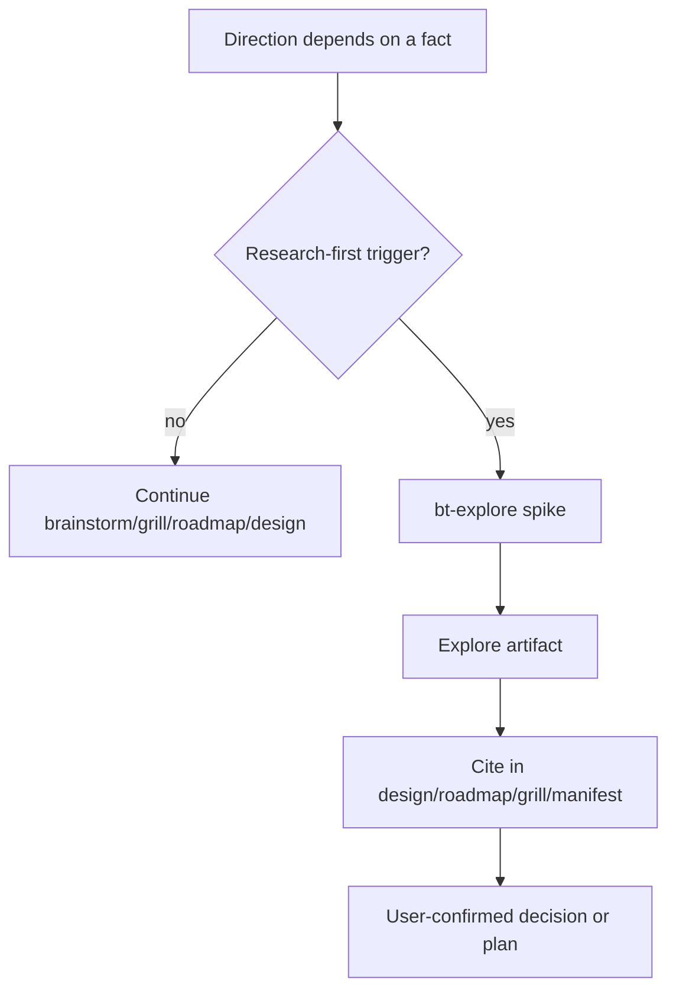

# research-first-explore-integration design

## 0. Terminology

- **Research-first Trigger**: a situation where a factual question can change the design, roadmap, or grill direction. Anti-conflict: it is not a requirement to research every feature.
- **Explore Spike Evidence**: a `bt-explore` artifact with `type: spike` that records observed facts, tradeoffs, confidence, and sources. Anti-conflict: it is not a final decision.
- **Comparable Workflow Evidence**: evidence from external workflows, libraries, APIs, platforms, or industry conventions that informs ByteTrue design. Anti-conflict: it is not copied wholesale into ByteTrue.
- **Evidence Reference**: a path to an explore artifact cited by design, roadmap, or context manifest. Anti-conflict: it is not duplicated excerpt text.

## 1. Decisions and Constraints

### Requirement summary

This feature makes research-first behavior explicit across the discussion/design/planning layer. When a technical choice, external API/library behavior, platform capability, or comparable workflow would materially change direction, the workflow should first route to `bt-explore` with `type: spike`, then cite the resulting explore artifact in the later design, roadmap, grill summary, or context manifest.

Success means:

- `.bytetrue/reference/research-first.md` and onboard copy define trigger conditions, output shape, and citation rules;
- `bt-explore` explicitly supports research-first spike as a reusable evidence artifact;
- `bt-brainstorm`, `bt-grill`, `bt-roadmap`, and `bt-feat-design` point to the research-first rule when a factual external/technical question can change direction;
- context manifests can include research-first explore artifacts as required evidence when cited by design;
- no research directory, automatic router, subagent dispatch, hook, breadcrumb, worklog, or CLI is introduced.

Explicit non-goals:

- do not require research-first for simple product preference, copy, UI, or already-clear local changes;
- do not let explore make final product, architecture, or roadmap decisions;
- do not create `.bytetrue/research/` or another facts layer;
- do not implement web automation, background research loops, or subagent dispatch;
- do not replace `bt-grill`, `bt-roadmap`, or `bt-feat-design`; research-first only supplies evidence.

### Complexity dimensions

This is a workflow-contract change. It follows the internal workflow/tooling default bundle. Deviations:

- **Public surface = stable**: discussion/planning skills gain a shared evidence-before-decision contract.
- **Persistence = existing compound explore**: output stays in `.bytetrue/compound/`.
- **Testability = static evidence**: verify by grep, line counts, YAML validation, and optional manifest row checks.

### Execution mode

```yaml
execution_mode:
  level: standard
  triggers: [normal-feature, workflow-contract, cross-boundary-contract]
  required_evidence: [manual-check, impact-surface-check, spec-compliance-review, code-quality-review]
```

Rationale: this affects multiple workflow skills and evidence flow, but adds no runtime system or risky business logic.

### Key decisions

1. **Use `bt-explore type=spike`, not a new research directory.**
   - Reason: ByteTrue already has a compound explore archive for observed facts.
2. **Research-first triggers only when facts can change direction.**
   - Reason: forcing research for every feature would add process tax.
3. **Explore records evidence, not decisions.**
   - Reason: final choices still belong to user-confirmed design, roadmap, grill convergence, or `bt-decide`.
4. **Shared rule lives in `research-first.md`.**
   - Reason: several skills need the same trigger/citation rule without bloating each skill file.
5. **Context manifests cite explore artifacts when they matter.**
   - Reason: later implement/check roles should not rediscover the same external facts.

## 2. Terms and Orchestration

### 2.1 Term Layer

#### Current state

- `bt-explore` supports `spike` but is mostly user-triggered.
- `bt-brainstorm` can suggest a minimal demo/spike for factual questions, but does not define a shared research-first artifact rule.
- `bt-grill` already says if docs/code can answer a question, do not ask the user; it does not name the reusable research-first output path.
- `bt-roadmap` and `bt-feat-design` read compound artifacts as needed, but do not require explore evidence when external facts drive the plan.
- `context-manifest.md` already allows relevant decision/explore evidence rows.

#### Change

Add shared reference contracts:

```text
.bytetrue/reference/research-first.md
skills/bt-onboard/reference/research-first.md
```

Trigger shape:

```yaml
research_first:
  trigger: external-tool-behavior | library-or-api-capability | platform-hook-capability | comparable-workflow | industry-convention | performance-or-cost-claim
  question: "What fact would change the direction?"
  output: .bytetrue/compound/YYYY-MM-DD-explore-{slug}.md
```

Citation shape:

```markdown
Related evidence:
- `.bytetrue/compound/YYYY-MM-DD-explore-{slug}.md` — {why this evidence matters}
```

### 2.2 Orchestration Layer



#### Current state

ByteTrue can research facts, but the trigger is implicit. Agents may ask the user to invent options before checking external docs, comparable workflows, or local evidence.

#### Change

- `bt-explore` labels research-first spike as a first-class use of `type: spike`.
- `bt-brainstorm` points factual external/library/workflow questions to `bt-explore spike` when the answer changes direction.
- `bt-grill` points evidence-backed factual checks to `bt-explore spike` before continuing the decision tree.
- `bt-roadmap` requires a related explore artifact when decomposition/interface contracts rely on external workflow/library/platform claims.
- `bt-feat-design` checks for existing explore evidence or creates one before drafting when a technical/external fact materially changes the design.
- `context-manifest.md` says cited research-first explores can be required manifest rows.

Flow-level constraints:

- Do not use research-first for preference-only questions.
- If a fact can be answered cheaply from existing project docs/code, read that first; only archive if the finding has future reuse value.
- Explore artifacts must state confidence and evidence; low-confidence research must not be treated as a hard constraint.
- The user still confirms final choices.

### 2.3 Mount-Point Inventory

- `.bytetrue/reference/research-first.md`: add current shared trigger/citation rule.
- `skills/bt-onboard/reference/research-first.md`: add onboard template copy.
- `skills/bt-explore/SKILL.md`: add research-first spike as an applicable scenario.
- `skills/bt-brainstorm/SKILL.md`: add a pointer in minimal demo/spike logic.
- `skills/bt-grill/SKILL.md`: add research-first pointer in with-docs factual checks.
- `skills/bt-roadmap/SKILL.md`: add material-reading rule for external/comparable workflow facts.
- `skills/bt-feat-design/SKILL.md`: add startup/design rule for external fact dependencies.
- `.bytetrue/reference/context-manifest.md`: add research-first explore artifacts as manifest candidates.
- `skills/bt-onboard/SKILL.md`, current/onboard `system-overview.md`: list the new reference file.

### 2.4 Rollout Strategy

1. **Shared contract**: add current/onboard `research-first.md`.
   - exit signal: both copies define trigger conditions, output shape, and citation rules.
2. **Exploration and discussion integration**: update `bt-explore`, `bt-brainstorm`, and `bt-grill`.
   - exit signal: discussion layer routes direction-changing factual questions to explore spike.
3. **Planning/design integration**: update `bt-roadmap` and `bt-feat-design`.
   - exit signal: roadmap/design require or cite explore evidence when external facts shape contracts.
4. **Manifest/onboard/index sync and validation**: update context manifest, onboard inventory, system overview; run checks.
   - exit signal: touched files stay under 300 lines, YAML validates, and no new research directory or runtime automation appears.

### 2.5 Structural Health and Micro-refactor

##### Evaluation

- file level — `bt-explore/SKILL.md`: 142 lines, safe for a concise scenario pointer.
- file level — `bt-brainstorm/SKILL.md`: 231 lines, safe for a concise pointer in minimal demo/spike section.
- file level — `skills/bt-grill/SKILL.md`: 197 lines, safe for one with-docs factual-check pointer.
- file level — `skills/bt-roadmap/SKILL.md`: 226 lines, safe for one material-reading rule.
- file level — `bt-feat-design/SKILL.md`: 267 lines, near limit; add only one concise startup rule.
- file level — `bt-onboard/SKILL.md`: 250 lines, inventory-only update.
- directory level — `.bytetrue/reference/` and onboard reference mirror named shared references; one more focused contract matches the pattern.
- compound convention search: no active convention blocks this placement.

##### Conclusion: do not refactor

No micro-refactor is needed. Full trigger/citation rules belong in `research-first.md`; stage skills only point to it.

## 3. Acceptance Contract

Key scenarios:

1. **Shared contract exists**: current and onboard `research-first.md` define triggers, output path, citation shape, and non-goals.
2. **Explore supports research-first**: `bt-explore` names research-first spike and still records evidence without final decisions.
3. **Discussion layer routes facts**: `bt-brainstorm` and `bt-grill` point direction-changing factual questions to explore spike.
4. **Planning/design routes facts**: `bt-roadmap` and `bt-feat-design` require or cite explore evidence when external facts shape contracts.
5. **Manifest carries evidence**: `context-manifest.md` allows cited research-first explore artifacts as manifest rows.
6. **No new facts layer**: grep confirms no `.bytetrue/research/`, automatic router, hook, subagent dispatch, worklog, or CLI behavior is introduced.
7. **Line budget**: all edited markdown files stay ≤300 lines.

Reverse-check items:

- no instruction says explore makes the final decision;
- no instruction forces research-first for pure preference questions;
- no new research directory or runtime automation is created;
- low-confidence explore evidence cannot become a hard constraint without user confirmation.

### 3.1 Test Seam / TDD Plan

- **TDD applicability**: not strict TDD. This is a workflow-contract feature.
- **Highest behavior seam**: future brainstorm/grill/roadmap/design references to explore evidence.
- **Priority red/green behaviors**:
  1. before implementation, no shared `research-first.md`; after implementation, current/onboard copies exist;
  2. discussion/planning/design skills point to research-first triggers;
  3. context manifests can include cited explore artifacts.
- **Manual verification items**: grep mount points, validate YAML, line counts, confirm no new research directory/runtime automation.

### 3.2 Behavior Delta

#### ADDED

- Requirement: ByteTrue has a shared research-first rule for direction-changing technical or external facts.
- Scenario: GIVEN a design or roadmap depends on an external library/API/workflow fact WHEN that fact can change the direction THEN the workflow first produces or references a `bt-explore` spike artifact.

#### MODIFIED

- Source: existing `bt-brainstorm`, `bt-grill`, `bt-roadmap`, `bt-feat-design`, and `bt-explore` behavior.
- Before: research/explore was available but not a named pre-decision rule.
- After: research-first is a shared rule and later artifacts cite explore evidence.

## 4. Relationship with Project-Level Architecture Docs

This feature changes ByteTrue workflow architecture by adding evidence-before-decision routing for technical choices and comparable workflow absorption.

Acceptance should update `.bytetrue/architecture/ARCHITECTURE.md` to record research-first explore integration as an execution-context discipline, not a new facts layer. Requirement `research-first-explore-integration` should become current after implementation lands.
