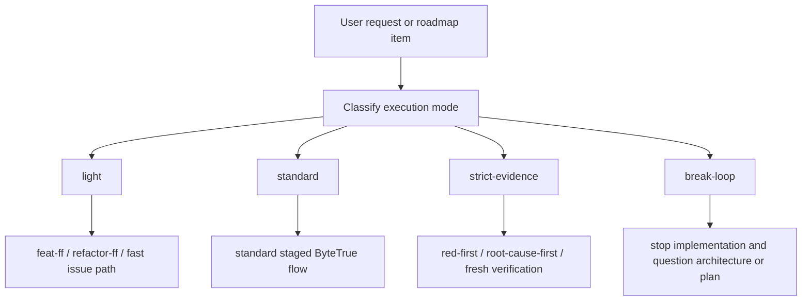

# risk-mode-discipline design

## 0. Terminology

- **Execution Mode**: a workflow-level classification that chooses how much discipline a run needs: `light`, `standard`, `strict-evidence`, or `break-loop`. Anti-conflict: it is not the same as code-dimension robustness/performance/readability levels.
- **Light Mode**: smallest reversible work, where full design/checklist overhead is not justified. Anti-conflict: light does not mean no verification.
- **Standard Mode**: normal ByteTrue staged workflow: design → implement → acceptance, or issue report → analyze → fix.
- **Strict Evidence Mode**: high-risk mode that requires Superpowers-style fresh evidence: red-first where testable, root-cause-first for bugs, and fresh verification before completion.
- **Break-loop Mode**: escalation mode when repeated fixes fail or architecture friction appears; normal implementation stops and the question becomes whether the pattern or architecture is wrong.

## 1. Decisions and Constraints

### Requirement summary

This feature defines the first ByteTrue execution-mode model. The goal is to absorb Superpowers' strongest strictness without making every task heavy. A small copy/config/UI change should stay light, normal feature work should keep the standard ByteTrue flow, and high-risk or repeated-failure work should automatically move into stricter evidence and architecture-questioning behavior.

Success means:

- there is one shared `execution-modes.md` contract under `.bytetrue/reference/` and `bt-onboard/reference/`;
- feature design records `execution_mode` in section 1;
- feature implementation reads and obeys that mode;
- issue analyze/fix use the same language for strict evidence and break-loop escalation;
- fastforward and refactor workflows know when they are allowed to stay light versus route to standard or break-loop.

Explicit non-goals:

- do not implement subagent review gates; that belongs to `implementation-review-gate`;
- do not implement context manifests; that belongs to `context-manifest-contract`;
- do not implement hook/breadcrumb enforcement;
- do not require strict TDD for every task;
- do not rename existing code-dimension levels or replace `code-dimensions.md`;
- do not add a new CLI or runtime state file.

### Complexity dimensions

This is a workflow-contract change. It follows the internal workflow/tooling default: L2 + functions/docs + reasonable + team + active + logged/testable. Deviations:

- **Public surface = stable**: execution modes affect future feature, issue, refactor, and fastforward guidance.
- **Testability = verified by docs/checks**: no runtime code is added; verification is grep, size count, YAML validation, and consistency review.

### Key decisions

1. **Create `execution-modes.md` instead of expanding shared-conventions.**
   - Reason: `shared-conventions.md` is already near the 300-volume control and should remain the index/lifecycle doc.
2. **Record mode in feature design section 1.**
   - Reason: mode changes the whole implementation and acceptance discipline, so it is a design-level constraint.
3. **Map issue strictness to the existing analyze/fix split.**
   - Reason: issue analysis already owns root-cause confirmation; issue fix owns regression evidence and verification.
4. **Keep `break-loop` as an escalation, not a normal mode selected casually.**
   - Reason: break-loop means the current plan may be wrong and should route to grill/refactor/roadmap/issue-analysis.

## 2. Terms and Orchestration

### 2.1 Term Layer

#### Current state

- `.bytetrue/reference/code-dimensions.md`: defines code-quality dimensions like robustness, testability, and security, but does not select workflow heaviness.
- `skills/bt-feat-design/SKILL.md`: says design section 3.1 decides TDD applicability, but no unified execution mode exists.
- `skills/bt-feat-impl/SKILL.md`: enables TDD when user asks, design recommends it, work is complex business logic, or regression-sensitive.
- `skills/bt-issue-analyze/SKILL.md`: has Matt-style enhanced diagnose triggers and records feedback loop, hypotheses, instrumentation, and regression seam.
- `skills/bt-issue-fix/SKILL.md`: prefers regression seam and switches to log-debugging when the fix does not work, but lacks a shared strict/break-loop vocabulary.
- `skills/bt-feat-ff/SKILL.md`: is the light path, but it lists stop conditions separately from any shared execution-mode model.
- `skills/bt-refactor/SKILL.md`: has behavior-equivalence and risk-oriented scan/design/apply rules, but no shared execution-mode contract.

#### Change

Add a shared reference contract:

```text
.bytetrue/reference/execution-modes.md
skills/bt-onboard/reference/execution-modes.md
```

Core shape:

```yaml
execution_mode:
  level: light | standard | strict-evidence | break-loop
  triggers: []
  required_evidence: []
```

Interface example in feature design:

```yaml
execution_mode:
  level: strict-evidence
  triggers: [regression-sensitive, cross-boundary-contract]
  required_evidence: [red-green, spec-compliance-review, fresh-verification]
```

### 2.2 Orchestration Layer



#### Current state

The current system has the pieces but not the shared selector. Lightness is expressed by `bt-feat-ff` and `bt-refactor-ff`; strictness is expressed by TDD paragraphs in `bt-feat-impl` and diagnose paragraphs in issue skills; break-loop behavior appears as log-debugging escalation in issue fix and architecture-friction language in refactor/grill. These are not tied together by one vocabulary.

#### Change

- Feature design writes `execution_mode` in section 1 and references `execution-modes.md`.
- Feature implementation reads the mode before starting and applies the required evidence rules.
- Issue analysis uses the mode vocabulary when enhanced diagnose triggers; issue fix reads it or derives it from analysis.
- Fastforward flows state they are valid only for `light` work and must route out when non-light triggers appear.
- Refactor uses the mode language to separate small behavior-equivalent cleanup from strict evidence or break-loop routing.

Flow-level constraints:

- Mode selection never bypasses existing human checkpoints.
- `strict-evidence` adds evidence requirements; it does not authorize extra scope.
- `break-loop` stops normal implementation until the plan/architecture question is answered.
- Code dimensions still govern implementation quality; execution mode governs workflow heaviness.

### 2.3 Mount-Point Inventory

- `.bytetrue/reference/execution-modes.md`: current project shared execution-mode contract.
- `skills/bt-onboard/reference/execution-modes.md`: onboard template for new projects.
- `skills/bt-onboard/SKILL.md`: reference file inventory and managed-file list include `execution-modes.md`.
- `skills/bt-onboard/reference/system-overview.md`: further references include execution modes.
- `skills/bt-feat-design/SKILL.md`: requires section 1 to record execution mode.
- `skills/bt-feat-design/reference.md`: adds section 1 writing requirements for execution mode.
- `skills/bt-feat-impl/SKILL.md`: reads and obeys execution mode before starting.
- `skills/bt-issue-analyze/SKILL.md`: maps enhanced diagnose triggers to strict/break-loop modes.
- `skills/bt-issue-fix/SKILL.md`: applies strict evidence and break-loop escalation rules.
- `skills/bt-feat-ff/SKILL.md`: declares fastforward as light-mode only and routes out on non-light triggers.
- `skills/bt-refactor/SKILL.md`: maps refactor ff/standard/full stop conditions to execution modes.

### 2.4 Rollout Strategy

1. **Shared contract**: add `execution-modes.md` to current project and onboard template.
   - exit signal: both files define the four modes, triggers, and required evidence.
2. **Feature workflow integration**: update `bt-feat-design` and `bt-feat-impl`.
   - exit signal: future designs record execution mode and implementation reads it.
3. **Issue workflow integration**: update `bt-issue-analyze` and `bt-issue-fix`.
   - exit signal: complex diagnose and failed-fix escalation use strict-evidence / break-loop language.
4. **Light/refactor routing**: update `bt-feat-ff` and `bt-refactor`.
   - exit signal: light paths explicitly route out when strict or break-loop triggers appear.
5. **Template/index sync and validation**: update onboard/system references, grep, size count, YAML validation.
   - exit signal: all touched md files remain concise and checklist validates.

### 2.5 Structural Health and Micro-refactor

##### Evaluation

- file level — `skills/bt-feat-design/SKILL.md` close to maintainer guidance; concise edits only.
- file level — `skills/bt-feat-design/reference.md` close to maintainer guidance; prefer short pointer to new reference over long embedded tables.
- file level — `skills/bt-feat-impl/SKILL.md` originally assessed as healthy for concise mode-reading additions.
- file level — `skills/bt-issue-analyze/SKILL.md` originally assessed as healthy.
- file level — `skills/bt-issue-fix/SKILL.md` originally assessed as healthy.
- file level — `skills/bt-feat-ff/SKILL.md` originally assessed as healthy.
- file level — `skills/bt-refactor/SKILL.md` close to maintainer guidance; concise routing addition only.
- file level — `skills/bt-onboard/SKILL.md` close to maintainer guidance; only inventory mentions.
- directory level — `.bytetrue/reference/` and `skills/bt-onboard/reference/`: already house shared reference docs; adding one focused file does not flatten beyond existing reference pattern.

##### Conclusion: do not refactor

No micro-refactor is needed. To avoid bloating near-limit files, the detailed mode table belongs in `execution-modes.md`; workflow skill files should only point to it and state their stage-specific responsibilities.

## 3. Acceptance Contract

Key scenarios:

1. **Shared contract exists**: opening `.bytetrue/reference/execution-modes.md` and `skills/bt-onboard/reference/execution-modes.md` → both define `light`, `standard`, `strict-evidence`, and `break-loop`.
2. **Feature design records mode**: reading `skills/bt-feat-design/SKILL.md` / `reference.md` → section 1 requires execution mode and links to execution-modes reference.
3. **Feature implementation obeys mode**: reading `skills/bt-feat-impl/SKILL.md` → startup checks include reading execution mode and applying evidence obligations.
4. **Issue workflow uses mode**: reading `bt-issue-analyze` and `bt-issue-fix` → complex bug diagnosis maps to `strict-evidence`; repeated failed fixes map to `break-loop`.
5. **Light routes stay light but bounded**: reading `bt-feat-ff` and `bt-refactor` → light mode is allowed only while triggers stay light; non-light triggers route out.
6. **No unrelated infrastructure**: grep → no context manifest, subagent handoff, hook/breadcrumb, or worklog implementation appears in this feature.
7. **Conciseness check**: edited documents stay concise.

Reverse-check items:

- no global requirement that every task must use strict TDD;
- no removal or replacement of `code-dimensions.md`;
- no new CLI/runtime state file;
- no implementation-review-gate or context-manifest behavior introduced early.

### 3.1 Test Seam / TDD Plan

- **TDD applicability**: not strict TDD. This is a documentation/workflow-contract feature.
- **Highest behavior seam**: future feature/issue/refactor skill guidance, verified by grep and manual review.
- **Priority red/green behaviors**:
  1. before implementation, no `execution-modes.md` exists; after implementation, both current and onboard copies exist;
  2. feature design and implementation guidance mention execution mode;
  3. issue and light/refactor workflows route strict and break-loop triggers correctly.
- **Manual verification items**: compare wording against roadmap contract section 2 and confirm the feature does not make Superpowers strictness global default.

### 3.2 Behavior Delta

#### ADDED

- Requirement: ByteTrue workflows can classify a run as light, standard, strict-evidence, or break-loop.
- Scenario: GIVEN a future feature design has high-risk triggers WHEN the design is approved THEN section 1 records `execution_mode` and implementation follows the required evidence.

#### MODIFIED

- Source: existing TDD/debug/refactor guidance in feature, issue, and refactor skills.
- Before: strictness rules exist as local paragraphs without one shared mode vocabulary.
- After: each relevant workflow maps its local rules to the shared execution-mode contract.

## 4. Relationship with Project-Level Architecture Docs

This feature changes the ByteTrue workflow architecture: it introduces a shared execution-mode selector across feature, issue, fastforward, and refactor workflows.

Acceptance should update `.bytetrue/architecture/ARCHITECTURE.md` with a key architecture decision: ByteTrue uses execution modes to decide workflow heaviness; strict evidence is trigger-based, not global default; break-loop stops implementation and routes back to planning/architecture discussion.
