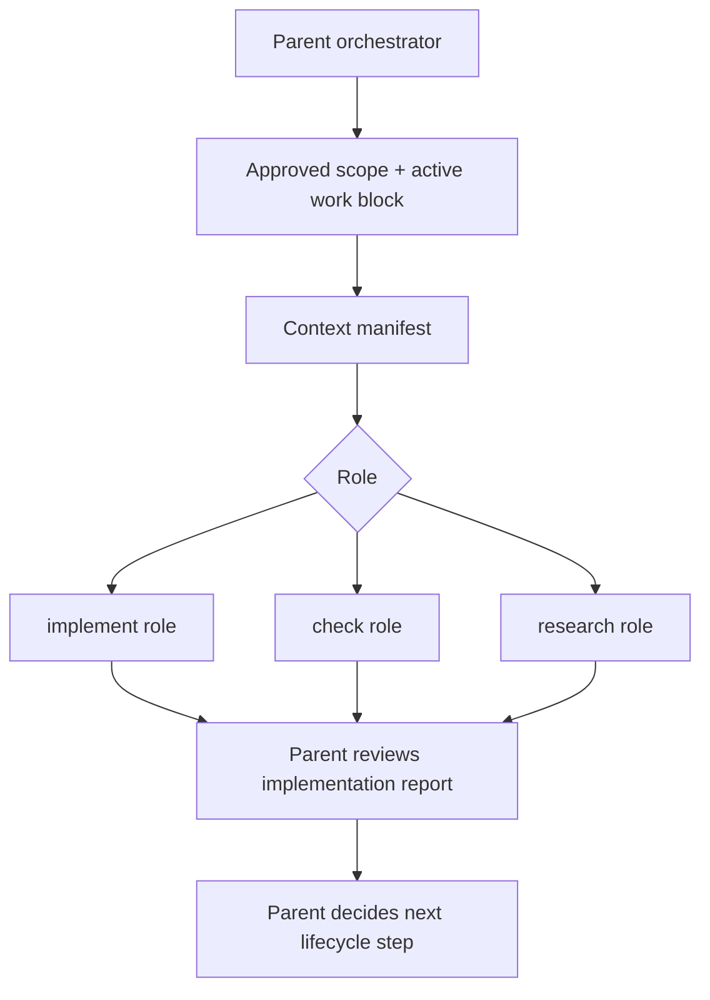

# subagent-handoff-roles design

## 0. Terminology

- **Subagent Handoff Protocol**: the fixed prompt contract used when a parent session delegates ByteTrue work to a child agent or performs the same role inline. Anti-conflict: it is not an automatic dispatcher or runtime hook.
- **Handoff Role**: one of `implement`, `check`, or `research`, each with different read/write authority. `check` includes the reviewer responsibility from Superpowers: spec-compliance review before code-quality review. Anti-conflict: a role is not a new ByteTrue stage.
- **Parent Orchestrator**: the main session that owns scope, user alignment, final synthesis, and acceptance progression. Anti-conflict: child agents do not own the lifecycle.
- **Child Agent**: a native subagent, synchronous non-interactive child agent, or inline role executor given a bounded task and explicit context manifest. Anti-conflict: child agents must not launch their own subagents unless explicitly assigned a fanout task.
- **Active Work Block**: the required prompt prefix that names active feature path, role, design, checklist, and manifest. Anti-conflict: it is not workflow-state breadcrumb; hooks are a later feature.

## 1. Decisions and Constraints

### Requirement summary

This feature defines the first ByteTrue subagent handoff protocol. When a tool supports subagents, the parent session can delegate implementation, checking, or research work using a fixed role contract. When the tool does not support subagents, the same role contract is followed inline.

Success means:

- `.bytetrue/reference/subagent-handoff.md` and the onboard template define roles, prompt prefix, authority boundaries, and stop rules;
- `bt-feat-impl` points implementation delegation to the `implement` role contract;
- `bt-feat-accept` points review/check delegation to the `check` role contract and keeps acceptance independent;
- `bt-explore` can be used as the `research` role output shape without making final product decisions;
- `bt-onboard` releases the reference;
- no hook/breadcrumb, research-first routing, worklog, new CLI, or project-specific agent files are created.

Explicit non-goals:

- do not implement automatic subagent dispatch;
- do not create `.pi/agents`, `.claude/agents`, chains, or custom runtime agent definitions;
- do not implement hook / breadcrumb injection;
- do not implement research-first routing from brainstorm/grill/roadmap;
- do not allow child agents to mark acceptance complete;
- do not make subagents required for tools that lack them.
- do not add a `planner` child role in v1; planning remains owned by ByteTrue roadmap / design / checklist checkpoints.

### Complexity dimensions

This is a workflow-contract and prompt-shape change. It follows the internal workflow/tooling default bundle. Deviations:

- **Public surface = stable**: future handoffs must use the role contract.
- **Integration = optional dispatch surface**: use native subagent when available, synchronous non-interactive child agent when available, and inline role execution otherwise.
- **Testability = static contract verification**: verify with grep, line counts, YAML validation, and context-manifest smoke checks.

### Execution mode

```yaml
execution_mode:
  level: standard
  triggers: [normal-feature, workflow-contract, cross-boundary-contract]
  required_evidence: [manual-check, impact-surface-check, spec-compliance-review, code-quality-review]
```

Rationale: this affects cross-tool workflow contracts and child-agent authority, but it does not add runtime dispatch or risky business logic.

### Key decisions

1. **Define protocol in `subagent-handoff.md`, not inside every skill.**
   - Reason: `bt-feat-impl`, `bt-feat-accept`, and `bt-explore` should carry short stage-specific pointers only.
2. **Role names are derived from the absorbed workflows, not from Pi's built-in agent taxonomy.**
   - Reason: Trellis provides implement/check/research roles; Superpowers' reviewer maps to `check`; OpenSpec does not add another execution role.
3. **Do not add `planner` in v1.**
   - Reason: ByteTrue planning is already handled by roadmap, feature design, and checklist review. A child planner would risk bypassing the human checkpoint before implementation.
4. **Parent orchestrator owns lifecycle decisions.**
   - Reason: Pi subagent guidance says the parent owns delegation, orchestration, review fanout, and final synthesis.
5. **Children receive active work + manifest, not parent memory.**
   - Reason: context manifests make the read-set explicit and portable across tools.
6. **No automatic dispatch in this feature.**
   - Reason: runtime dispatch, hooks, and breadcrumbs are later roadmap items; this feature defines the contract they will consume.
7. **Research role writes explore evidence, not final product decisions.**
   - Reason: durable decisions still require user confirmation and `bt-decide` when appropriate.

## 2. Terms and Orchestration

### 2.1 Term Layer

#### Current state

- `ai-workflow-absorption-contracts.md` defines a target prompt prefix and implement/check/research responsibilities; those roles come from Trellis and Superpowers, not from Pi's built-in agent list.
- `.bytetrue/reference/context-manifest.md` defines `impl-context` and `check-context` read-set files.
- `.bytetrue/reference/implementation-review.md` says subagent review is optional future enhancement.
- Pi subagents guidance requires the parent orchestrator to own delegation and child agents to receive concrete role-specific tasks.
- `bt-feat-impl`, `bt-feat-accept`, and `bt-explore` do not yet share one handoff protocol.

#### Change

Add shared reference contracts:

```text
.bytetrue/reference/subagent-handoff.md
skills/bt-onboard/reference/subagent-handoff.md
```

Required Active Work Block:

```text
Active ByteTrue work: .bytetrue/features/YYYY-MM-DD-{slug}
Role: implement | check | research
Design: .bytetrue/features/YYYY-MM-DD-{slug}/{slug}-design.md
Checklist: .bytetrue/features/YYYY-MM-DD-{slug}/{slug}-checklist.yaml
Context manifest: .bytetrue/features/YYYY-MM-DD-{slug}/{slug}-{impl|check}-context.jsonl
```

Role contract summary:

```yaml
roles:
  implement:
    reads: [design, checklist, impl-context]
    may_write: [code, checklist steps status, implementation report]
    must_not: [mark acceptance checks passed, change scope silently]
  check:
    reads: [design, checklist, check-context, git diff]
    may_write: [review findings]
    must_check: [spec compliance, code quality, fresh verification]
  research:
    reads: [scoped question, relevant project docs/code/web docs]
    writes: [.bytetrue/compound/YYYY-MM-DD-explore-{slug}.md]
    must_not: [make final product decision]
```

### 2.2 Orchestration Layer



#### Current state

ByteTrue can already run stages inline. Pi also has a `subagent` tool and role agents, but ByteTrue has no stable protocol saying what a child must receive or what it may decide.

#### Change

- `bt-feat-impl` points optional delegated implementation to the `implement` role and requires the active work block plus `impl-context`.
- `bt-feat-accept` points optional delegated checking to the `check` role and requires `check-context`; acceptance still remains the parent-owned final gate.
- `bt-explore` can serve the `research` role: it returns explore evidence and must not decide product direction.
- Tools without subagents follow the same role contract inline.

Flow-level constraints:

- Parent orchestrator keeps user alignment, scope changes, final synthesis, and lifecycle transitions.
- Child agents do not launch nested subagents unless explicitly assigned a fanout task by the parent.
- A child may report blocked; the parent updates manifest, design, or plan rather than retrying blindly.
- Child success reports are evidence, not final acceptance.
- Subagent prompts must not depend on hidden parent chat history; required context paths must be in the active work block or manifest.

### 2.3 Mount-Point Inventory

- `.bytetrue/reference/subagent-handoff.md`: add current shared handoff contract.
- `skills/bt-onboard/reference/subagent-handoff.md`: add onboard template copy.
- `skills/bt-feat-impl/SKILL.md`: add optional implement-role handoff rule.
- `skills/bt-feat-accept/SKILL.md`: add optional check-role handoff rule and preserve independent acceptance.
- `skills/bt-explore/SKILL.md`: add research-role handoff boundary.
- `skills/bt-onboard/SKILL.md`, current/onboard `system-overview.md`: list the new reference file.
- `.bytetrue/reference/context-manifest.md`: mention that handoff roles consume the manifests.

### 2.4 Rollout Strategy

1. **Shared contract**: add current/onboard `subagent-handoff.md`.
   - exit signal: both copies define active work block, implement/check/research roles, authority boundaries, and stop rules.
2. **Stage integration**: update `bt-feat-impl`, `bt-feat-accept`, and `bt-explore` with short role-specific pointers.
   - exit signal: each stage points to the shared contract and states its role boundary.
3. **Context/onboard sync**: update context manifest, onboard inventory, and system overview references.
   - exit signal: reference index and onboard managed files include `subagent-handoff.md`.
4. **Validation**: run YAML validation, line counts, and scope-guard grep.
   - exit signal: edited markdown files stay under 300 lines and no runtime dispatch artifacts are created.

### 2.5 Structural Health and Micro-refactor

##### Evaluation

- file level — `skills/bt-feat-impl/SKILL.md`: 241 lines, safe for a short pointer.
- file level — `skills/bt-feat-accept/SKILL.md`: 264 lines, near limit; add only a concise check-role note.
- file level — `skills/bt-explore/SKILL.md`: check before implementation; expected to receive a concise research-role note.
- file level — `skills/bt-onboard/SKILL.md`: 249 lines, inventory-only update.
- file level — `.bytetrue/reference/context-manifest.md`: 85 lines, safe for a one-line relationship note.
- directory level — `.bytetrue/reference/` and `skills/bt-onboard/reference/`: named shared references already exist; adding one focused handoff contract follows the pattern.
- compound convention search: no active convention blocks this placement.

##### Conclusion: do not refactor

No micro-refactor is needed. The detailed role contract belongs in `subagent-handoff.md`; stage skills should only point to it and state their stage-specific boundary.

## 3. Acceptance Contract

Key scenarios:

1. **Shared contract exists**: current and onboard `subagent-handoff.md` define active work block, role responsibilities, parent authority, and stop rules.
2. **Implementation role integrated**: `bt-feat-impl` mentions optional `implement` handoff and keeps checklist/code/report boundaries.
3. **Check role integrated**: `bt-feat-accept` mentions optional `check` handoff and still performs independent acceptance.
4. **Research role integrated**: `bt-explore` can be used as research role and writes explore evidence without final decisions.
5. **Manifest relationship exists**: `context-manifest.md` says subagent handoff consumes manifests.
6. **No runtime dispatch**: grep confirms no `.pi/agents`, `.claude/agents`, chain, hook, breadcrumb, worklog, or CLI behavior is introduced.
7. **Line budget**: all edited markdown files stay ≤300 lines.

Reverse-check items:

- no child role may mark acceptance complete;
- no instruction says subagents are mandatory;
- no instruction tells children to rely on parent chat history instead of manifest paths;
- no automatic dispatch or nested subagent workflow is introduced.

### 3.1 Test Seam / TDD Plan

- **TDD applicability**: not strict TDD. This is a workflow-contract and prompt-shape feature.
- **Highest behavior seam**: future native subagent prompts, non-interactive child-agent prompts, and inline role execution reports.
- **Priority red/green behaviors**:
  1. before implementation, no shared `subagent-handoff.md`; after implementation, current/onboard copies exist;
  2. implementation and check stage guidance point to role contract;
  3. research role is bounded to explore evidence.
- **Manual verification items**: grep mount points, line counts, YAML validation, and scope guard for no runtime dispatch artifacts.

### 3.2 Behavior Delta

#### ADDED

- Requirement: ByteTrue has a shared handoff protocol for implement, check, and research roles.
- Scenario: GIVEN the parent delegates a ByteTrue feature task WHEN it creates a child prompt THEN the prompt starts with Active ByteTrue work, role, design, checklist, and context manifest paths.

#### MODIFIED

- Source: existing `bt-feat-impl`, `bt-feat-accept`, and `bt-explore` role boundaries.
- Before: delegation rules were implicit or tool-specific.
- After: role handoff is explicit and can be used through native subagents, non-interactive child agents, or inline fallback.

## 4. Relationship with Project-Level Architecture Docs

This feature changes ByteTrue workflow architecture by defining the role contract that consumes context manifests: parent orchestrator owns lifecycle decisions; child roles execute bounded implement/check/research tasks.

Acceptance should update `.bytetrue/architecture/ARCHITECTURE.md` to record subagent handoff as an optional execution infrastructure layer, not a required runtime dependency. Requirement `subagent-handoff-roles` should become current after implementation lands.
