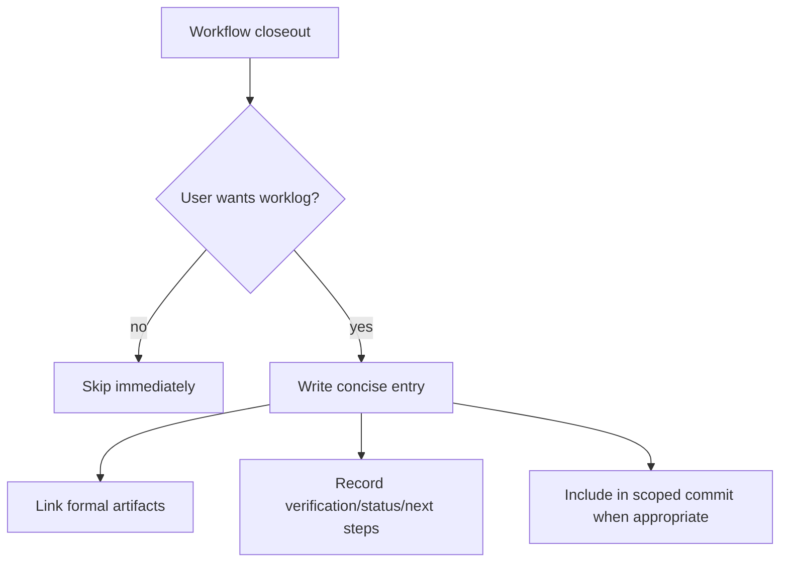

# worklog-report-feed design

## 0. Terminology

- **Worklog Entry**: a concise record of one work interval or closeout, with artifacts, summary, verification, status, and next steps. Anti-conflict: it is not a full transcript.
- **Report Feed**: chronological collection of worklog entries used for weekly reports, handoff, recovery background, and audit. Anti-conflict: it is not a source of truth for requirements or architecture.
- **Worklog File**: markdown file under `.bytetrue/worklog/` that stores entries for a time period. Anti-conflict: if it grows near the repo line limit, split it.
- **Formal Artifact Link**: path to feature, issue, roadmap, refactor, requirement, architecture, or compound docs. Anti-conflict: worklog points to these, it does not duplicate them.
- **Closeout Worklog Prompt**: optional prompt offered by workflows after formal artifacts are complete. Anti-conflict: it is not mandatory and must be skipped immediately when the user says no.

## 1. Decisions and Constraints

### Requirement summary

This feature adds a lightweight project-level worklog/report-feed. It records what happened across work intervals in a human-readable feed, while leaving formal truth in existing ByteTrue artifacts.

Success means:

- `.bytetrue/reference/worklog-report-feed.md` and the onboard copy define path, entry shape, line-limit split rule, and non-goals;
- `.bytetrue/worklog/` exists for current projects and onboard creates it for new projects;
- completed feature acceptance, issue fix, refactor, and roadmap closeout can offer a one-sentence optional worklog prompt;
- worklog entries point to formal artifacts and verification commands rather than copying chat transcripts;
- no per-developer workspace, raw transcript storage, Magic Context export, automatic session scraping, or CLI is introduced.

Explicit non-goals:

- do not create a Trellis-style `.trellis/workspace/<developer>/journal-N.md` clone;
- do not store raw chat transcripts;
- do not make worklog a requirement / architecture / decision source;
- do not auto-generate worklogs from Magic Context or Pi session history;
- do not require every closeout to write a worklog entry;
- do not solve long-term conventions here; those still go to `bt-decide`, `bt-learn`, `bt-trick`, or `bt-note`.

### Complexity dimensions

This follows default workflow-document infrastructure. Deviations:

- **Persistence = append-only report feed**: markdown entries are appended under `.bytetrue/worklog/`.
- **Volume control = line-limit split**: worklog files must stay under 300 lines; split monthly files when needed.
- **Automation = none**: first version is user-confirmed manual write by the active workflow, not a watcher or session scraper.

### Execution mode

```yaml
execution_mode:
  level: standard
  triggers: [workflow-contract]
  required_evidence: [manual-check, spec-compliance-review, code-quality-review]
```

TDD is not suitable; this is workflow contract and documentation behavior.

### Key decisions

1. **Use `.bytetrue/worklog/`, not compound.**
   - Reason: worklog entries are chronological work records, not durable decisions/learnings/explores/tricks.
2. **Default file is `.bytetrue/worklog/YYYY-MM.md`, with split files when needed.**
   - Reason: roadmap contract names the monthly file; split suffixes keep the repo md ≤300-line constraint.
3. **Worklog is optional closeout, not mandatory.**
   - Reason: mandatory logging would add process tax and duplicate formal artifacts.
4. **No raw transcript.**
   - Reason: Magic Context and chat logs are not repo-level team artifacts; worklog is a human summary.
5. **Prompt before commit with same-commit semantics.**
   - Reason: if the entry is committed together with the work, the exact hash is not known yet; the entry may say `pending same close-out`.

## 2. Terms and Orchestration

### 2.1 Term Layer

#### Current state

- No `.bytetrue/worklog/` directory exists.
- Closeout flows ask for learning, decision, tracker, guide, libdoc, attention, and commit, but not worklog/report-feed.
- Formal artifacts already carry final truth: feature acceptance, issue fix-note, roadmap, requirements, architecture, and compound docs.
- Trellis journal explore concluded ByteTrue should absorb a work-record layer, not raw per-developer transcript journals.

#### Change

Add shared reference:

```text
.bytetrue/reference/worklog-report-feed.md
skills/bt-onboard/reference/worklog-report-feed.md
```

Add project directory:

```text
.bytetrue/worklog/.gitkeep
```

Worklog file convention:

```text
.bytetrue/worklog/YYYY-MM.md
.bytetrue/worklog/YYYY-MM-02.md   # only when the first file would exceed the line limit
```

Entry shape:

```markdown
## YYYY-MM-DD · {short title}

- **Actor**: {human / agent / tool if known}
- **Scope**: {feature | issue | roadmap | refactor | explore | decision | other}
- **Artifacts**:
  - `.bytetrue/...`
- **Summary**: {1-3 sentences}
- **Commits**: `{hash}` / `pending same close-out` / none
- **Verification**: {commands, manual checks, or not applicable}
- **Status**: done | partial | blocked | follow-up
- **Next steps**:
  - ...
```

### 2.2 Orchestration Layer



#### Current state

Workflows close out by writing formal artifacts and asking about downstream archives or commits. Partial context stays in conversation memory unless captured manually in compound or attention.

#### Change

- `bt-feat-accept` closeout offers worklog entry after guide/libdoc/attention checks and before scoped commit.
- `bt-issue-fix` closeout offers worklog entry before commit.
- `bt-refactor` closeout offers worklog entry after verification and before commit.
- `bt-roadmap` closeout offers worklog entry for large planning sessions after tracker prompt.
- Worklog prompt is one sentence and optional, following shared closeout rules.
- Worklog entry is written only after user confirmation.
- If exact commit hash is not known because the entry will be committed together with the work, write `pending same close-out`.

Flow-level constraints:

- Worklog entries must link formal artifacts; do not duplicate their content.
- Worklog files must stay under 300 lines; if the current month file is near the limit, continue in the next split file.
- Worklog is append-only; corrections are new entries unless the current closeout is still being edited.
- Worklog does not replace learning / decision / note; it may point to those artifacts.
- Worklog can record partial sessions only when the user explicitly asks or the workflow leaves useful continuation context.

### 2.3 Mount-Point Inventory

- `.bytetrue/reference/worklog-report-feed.md`: current shared contract.
- `skills/bt-onboard/reference/worklog-report-feed.md`: onboard template copy.
- `.bytetrue/worklog/.gitkeep`: current project worklog directory.
- `skills/bt-onboard/SKILL.md`: skeleton creates worklog directory and managed reference.
- `.bytetrue/reference/system-overview.md` and onboard copy: reference index.
- `skills/bt-feat-accept/SKILL.md`: closeout prompt for feature acceptance.
- `skills/bt-issue-fix/SKILL.md`: closeout prompt for issue fix.
- `skills/bt-refactor/SKILL.md`: closeout prompt for refactor workflow.
- `skills/bt-roadmap/SKILL.md`: closeout prompt for roadmap planning sessions.

### 2.4 Rollout Strategy

1. **Shared contract**: add current/onboard `worklog-report-feed.md` and current `.bytetrue/worklog/.gitkeep`.
   - exit signal: contract defines path, entry shape, line split rule, and non-goals.
2. **Closeout prompts**: add optional worklog prompt to feature accept, issue fix, refactor, and roadmap closeout.
   - exit signal: each prompt is one sentence, optional, and before commit when applicable.
3. **Onboard/index sync**: update onboard skeleton and system overview references.
   - exit signal: new projects get `.bytetrue/worklog/` and the shared reference.
4. **Validation**: run grep, YAML/JSONL, line counts, and scope guards.
   - exit signal: no raw transcript, no auto session scraping, no CLI, no per-developer journal clone.

### 2.5 Structural Health and Micro-refactor

##### Evaluation

- file level — `bt-feat-accept/SKILL.md`: 265 lines, safe for one concise closeout line.
- file level — `bt-issue-fix/SKILL.md`: under 200 lines, safe for one concise closeout line.
- file level — `bt-refactor/SKILL.md`: around 250 lines, safe for one concise closeout line.
- file level — `bt-roadmap/SKILL.md`: around 227 lines, safe for one concise closeout line.
- file level — `bt-onboard/SKILL.md`: around 252 lines, safe for inventory-only update.
- directory level — `.bytetrue/worklog/`: new directory with `.gitkeep`; not flattened.
- compound convention search: no existing convention blocks this path.

##### Conclusion: do not refactor

No micro-refactor is needed. The full contract belongs in `worklog-report-feed.md`; workflow skills only need short closeout prompts.

## 3. Acceptance Contract

Key scenarios:

1. **Shared contract exists**: current/onboard `worklog-report-feed.md` define directory, file naming, entry shape, split rule, and non-goals.
2. **Worklog directory exists**: current project has `.bytetrue/worklog/.gitkeep`, and onboard skeleton includes worklog.
3. **Feature closeout prompt exists**: `bt-feat-accept` offers optional worklog before scoped commit.
4. **Issue/refactor/roadmap prompts exist**: `bt-issue-fix`, `bt-refactor`, and `bt-roadmap` can offer worklog entries at closeout.
5. **Line-limit guard exists**: contract requires split files before any worklog markdown exceeds 300 lines.
6. **No transcript or automation behavior**: grep confirms no raw transcript storage, auto session scraping, CLI, watcher, or per-developer journal clone.
7. **Worklog remains secondary**: wording states it links formal artifacts and does not replace them.

Reverse-check items:

- no `.trellis/workspace` clone;
- no auto export from Magic Context or Pi session files;
- no instruction says worklog is required for completion;
- no worklog entry duplicates full acceptance/fix-note content.

### 3.1 Test Seam / TDD Plan

- **TDD applicability**: not applicable; this is a workflow contract and closeout prompt feature.
- **Highest behavior seam**: grep-based evidence plus manual review of prompt order and reference content.
- **Manual verification items**: line counts, YAML/JSONL validation, grep scope guard, and closeout prompt presence.

### 3.2 Behavior Delta

#### ADDED

- Requirement: ByteTrue has a project-level optional worklog/report-feed for concise work records.
- Scenario: GIVEN a completed feature/issue/refactor/roadmap closeout WHEN the user wants a worklog entry THEN the workflow writes a concise entry under `.bytetrue/worklog/` linking formal artifacts and verification.

#### MODIFIED

- Source: closeout flows in feature acceptance, issue fix, refactor, and roadmap.
- Before: closeout asks about learning/decision/tracker/guide/libdoc/attention/commit, but no report-feed entry.
- After: closeout can offer an optional worklog prompt without making it mandatory.

## 4. Relationship with Project-Level Architecture Docs

This feature adds a secondary work-record layer. Acceptance should update `.bytetrue/architecture/ARCHITECTURE.md` to record that worklog/report-feed is chronological background for reports, handoff, recovery, and audit; formal artifacts remain source of truth. Requirement `worklog-report-feed` should become current after implementation lands.
