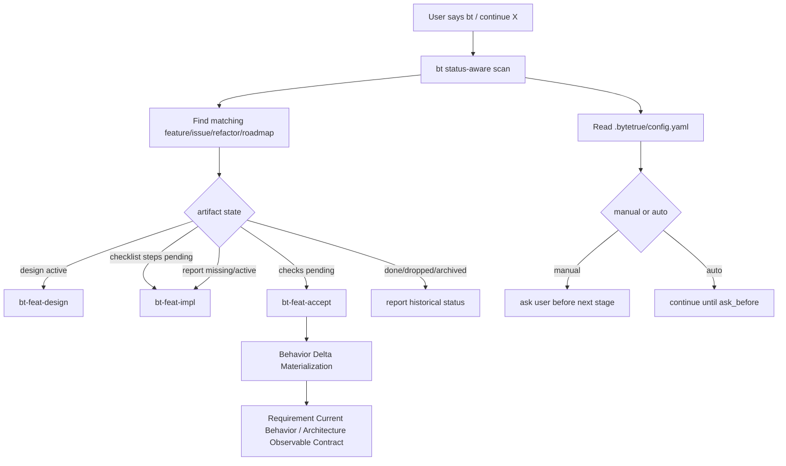

# workflow-control-plane-contract design

## 0. Terminology

- **Skills-first Control Plane**: deterministic project configuration and artifact conventions that ByteTrue skills can read. It may later be supported by CLI/scripts, but is not a hidden runtime, daemon, or hook system.
- **Project Config**: `.bytetrue/config.yaml`, the machine-readable home for tracker, workflow mode, dispatch preference, ask-before boundaries, and project doc policy.
- **Canonical Status**: the only allowed `status` vocabulary for ByteTrue workflow artifacts: `pending`, `active`, `done`, `dropped`, `archived`.
- **Continuation Scan**: the `bt` / `bt-feat` logic that maps existing artifacts to the correct next skill when the user says “continue X”.
- **Open Brainstorm**: a large or still-uncommitted discussion stored under `.bytetrue/brainstorms/{slug}/`, separate from feature-local `{slug}-brainstorm.md`.
- **Current Behavior / Observable Contract**: sections inside requirements or architecture where accepted Behavior Delta materializes as stable ByteTrue fact.
- **Auto Mode**: config mode where ByteTrue can continue low-risk steps automatically until an `ask_before` boundary. Default remains `manual`.

## 1. Decisions and constraints

### 1.1 Requirement summary

This feature updates ByteTrue workflow skills and shared references so configuration is machine-readable, status words are uniform, continuation routing is reliable, open brainstorms have one path, accepted behavior changes land back in existing fact layers, and auto mode is consumed by stage close-out / tracker rules rather than remaining a passive config field.

### 1.2 Explicit non-goals

- Do not add `.bytetrue/specs/`.
- Do not implement CLI, hook, daemon, runtime state, background agent, or custom dispatcher in this feature.
- Do not physically archive or move old feature/issue/refactor directories.
- Do not treat this repository's maintainer-only Markdown maintenance rule as a universal ByteTrue artifact rule.
- Do not preserve scattered config values after `.bytetrue/config.yaml` is introduced.
- Do not let auto mode bypass `ask_before` boundaries.

### 1.3 Complexity dimensions

- **Workflow contract**: high — multiple skills must use the same config/status vocabulary.
- **Runtime code**: none — pure skill/artifact change.
- **Migration risk**: medium — existing skills use `draft`, `approved`, `confirmed`, `current`, and `completed` as status values.
- **User impact**: high — continuation requests should stop misrouting completed historical work.

### 1.4 Execution mode

```yaml
execution_mode:
  level: standard
  triggers: [workflow-contract, documentation-only, cross-skill-convention]
  required_evidence: [manual-check, spec-compliance-review, code-quality-review]
```

TDD is not applicable.

### 1.5 Key decisions

1. Add `.bytetrue/config.yaml` and `.bytetrue/reference/config.md`.
2. Define canonical `status` values: `pending`, `active`, `done`, `dropped`, `archived`.
3. Replace status words such as `approved`, `confirmed`, `current`, `completed`, and `outdated` in workflow artifacts with the canonical vocabulary.
4. When extra meaning is needed, use non-status fields such as `reviewed: true`, `current: true`, `validity: current|outdated`, `review_result: approved`, or `superseded_by`, rather than inventing another status value.
5. Make `bt` and `bt-feat` continuation routing read enough artifact state to resume a feature deterministically.
6. Standardize `.bytetrue/brainstorms/` for open large discussion records.
7. Strengthen Behavior Delta materialization into requirement `Current Behavior` and architecture `Observable Contract` sections when stable.
8. Keep only two workflow modes: `manual` and `auto`.
9. Make volume-control policy configurable/project-scoped, with this repo defaulting to stricter skill/reference docs but not universal design/acceptance limits.

## 2. Terms and orchestration

### 2.1 Term layer, current state → change

- **Project Config**
  - Current state: current tracker and sync values live inside `project-management.md` prose/YAML.
  - Change: add `.bytetrue/config.yaml`; reference docs explain the fields, but config owns current values.
  - Shape example, not current values:
    ```text
    version: 1
    workflow:
      mode: manual | auto
      ask_before: [operation_key, ...]
    tracker:
      provider: local | github | gitlab
      sync_policy: ask | never | auto_preview
    dispatch:
      preferred: auto | native_subagent | non_interactive_child | inline
      allow_non_interactive_child: true | false
      allow_background_agents: true | false
    ```
  - Source location: `.bytetrue/reference/project-management.md`, `.bytetrue/reference/subagent-handoff.md`, `AGENTS.md`.

- **Canonical Status**
  - Current state: statuses differ by layer: `draft`, `approved`, `confirmed`, `current`, `completed`, `outdated`, `done`, `dropped`.
  - Change: `status` uses only `pending | active | done | dropped | archived` across ByteTrue workflow artifacts.
  - Example mappings:
    - design before approval: `status: active`, `review_result: pending`
    - design approved: `status: done`, `review_result: approved`
    - requirement current: `status: done`, `current: true`
    - outdated/superseded doc: `status: archived`, `validity: outdated`, `superseded_by: ...`
    - roadmap completed: `status: done`
    - roadmap item planned: `status: pending`
  - Source location: `.bytetrue/reference/shared-conventions.md`, `skills/bt-*` status checks.

- **Continuation Scan**
  - Current state: `bt` may notice a directory and ask if the user wants to continue even when the work is done.
  - Change: when the user says “bt continue {feature}”, route by artifacts:
    - no design or design `status: active` → `bt-feat-design`
    - design `status: done` + checklist steps pending/failed → `bt-feat-impl`
    - steps done + missing/active implementation report → `bt-feat-impl`
    - implementation report done + checklist checks pending/failed → `bt-feat-accept`
    - acceptance `status: done` → say it is completed history, not an active continuation
  - Source location: `skills/bt/SKILL.md`, `skills/bt-feat/SKILL.md`.

- **Open Brainstorm**
  - Current state: path language is mixed between `brainstorm/` and `brainstorms/`.
  - Change: `.bytetrue/brainstorms/{slug}/brainstorm.md` holds open large discussion records; feature-local brainstorm note stays in `features/{feature}/{slug}-brainstorm.md`.
  - Source location: `.bytetrue/reference/shared-conventions.md`, `skills/bt-brainstorm/SKILL.md`.

- **Current Behavior / Observable Contract**
  - Current state: acceptance can materialize Behavior Delta, but stable behavior may remain only in acceptance tables.
  - Change: stable deltas write into requirements `Current Behavior` and architecture `Observable Contract` when they outlive one feature.
  - Source location: `skills/bt-feat-accept/SKILL.md`, requirement/architecture templates.

### 2.2 Orchestration layer



Flow constraints:

- Config stores choices, not work-state history.
- Status fields are canonical; extra semantics belong in other fields.
- Auto mode does not bypass `ask_before`.
- Completed artifacts remain in place; no physical archive in this feature.

### 2.3 Mount points

- `.bytetrue/config.yaml`: new config values.
- `.bytetrue/reference/config.md` and onboard copy: config field reference.
- `.bytetrue/reference/shared-conventions.md` and onboard copy: canonical status, brainstorms path, config path, volume-control policy.
- `AGENTS.md` / `CLAUDE.md`: clarify maintainer-only documentation guidance as this repo's skill/reference maintenance rule.
- `skills/bt/SKILL.md`: status-aware continuation routing.
- `skills/bt-feat/SKILL.md`: deterministic feature resume table.
- `skills/bt-brainstorm/SKILL.md`: open brainstorm path.
- `skills/bt-feat-accept/SKILL.md`: Behavior Delta stable writeback guidance.
- `skills/bt-onboard/SKILL.md`: create config and `brainstorms/`, copy config reference.
- `.bytetrue/reference/project-management.md`: remove current provider values, keep semantic explanation.
- `.bytetrue/reference/system-overview.md`: index config and brainstorms.

### 2.4 Rollout strategy

1. Add config contract and current `.bytetrue/config.yaml`.
2. Update shared conventions and onboard reference templates.
3. Update status wording in affected skill checks.
4. Update `bt` / `bt-feat` continuation logic.
5. Update brainstorm and Behavior Delta writeback language.
6. Validate YAML, JSONL, skill listing, frontmatter, reference parity, line-count policy.

### 2.5 Micro-refactor judgment

No code refactor. This feature is a workflow contract update.

## 3. Acceptance contract

### 3.1 Test seam / verification plan

No runtime TDD. Static verification:

- `.bytetrue/config.yaml` parses as YAML.
- grep confirms canonical status list appears in shared conventions and status checks.
- grep confirms old status words are no longer used as `status:` values in updated templates or skill examples.
- grep confirms `bt` and `bt-feat` can route “continue feature” by artifact state.
- grep confirms `.bytetrue/brainstorms/` is canonical open discussion path.
- grep confirms Behavior Delta writeback mentions `Current Behavior` and `Observable Contract`.
- grep confirms no hard-coded maintainer-only documentation guidance remains in `skills/` or `.bytetrue/reference/`; code-size heuristics such as “component oversized” may remain because they are refactor signals, not document policy.
- frontmatter and skill listing still parse.

### 3.2 Behavior Delta

#### ADDED

- **Requirement**: ByteTrue has a machine-readable project config.
- **Scenario**:
  - GIVEN `.bytetrue/config.yaml`
  - WHEN a skill needs tracker provider, workflow mode, dispatch preference, or ask-before boundaries
  - THEN it reads config values instead of scraping prose docs.

- **Requirement**: ByteTrue has one canonical status vocabulary.
- **Scenario**:
  - GIVEN a ByteTrue artifact with frontmatter `status`
  - WHEN an AI reads it
  - THEN the value is one of `pending`, `active`, `done`, `dropped`, or `archived`.

- **Requirement**: continuation routing works for a half-implemented feature.
- **Scenario**:
  - GIVEN a user says “bt continue {feature}”
  - WHEN design/checklist/implementation-report/acceptance artifacts indicate the current stage
  - THEN `bt` routes to the correct next `bt-feat-*` skill or reports that the feature is already done.

#### MODIFIED

- **Source**: Behavior Delta materialization.
- **Before**: materialization can stay mostly in acceptance report.
- **After**: stable behavior writes into requirement `Current Behavior` or architecture `Observable Contract`.

- **Source**: volume-control policy and existing worklog/shared-conventions wording that hard-codes maintainer-only documentation guidances.
- **Before**: project rules or worklog/reference text can imply ByteTrue artifacts universally need a split.
- **After**: shipped skills and references do not hard-code a universal artifact volume rule; volume controls belong to project config or repo-local maintainer policy.

#### REMOVED

- **Source**: scattered machine config values in prose docs.
- **Reason**: current values belong in `.bytetrue/config.yaml`.
- **Migration / Compatibility**: no compatibility path for this repo.

## 4. Relationship with project-level architecture docs

Acceptance should update:

- `.bytetrue/architecture/ARCHITECTURE.md`: record skills-first control plane, canonical status vocabulary, config file, status-aware routing, and no hidden runtime.
- `.bytetrue/requirements/workflow-control-plane-contract.md`: upgrade to current.
