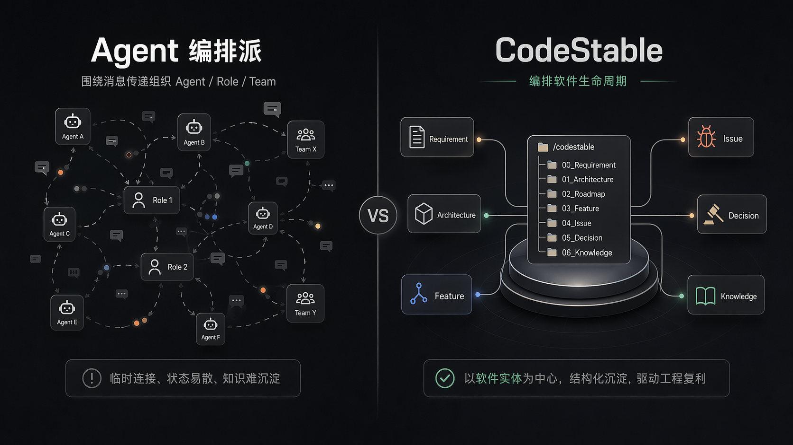

<div align="center">

# ByteTrue


**English** · [中文](./README.md)

**An AI coding workflow for serious software engineering**

Tired of OpenSpec's flimsiness, Oh-My-OpenAgent's over-engineering, and Superpowers' fragmentation — I built a lightweight, **human-in-the-loop** AI harness from scratch.

<p>
  
  
  
</p>

</div>

---

## Install

```bash
npx skills add https://github.com/liuzhengdongfortest/ByteTrue
```

One command to start working:

```bash
/bt-onboard
```

For daily use, when you do not know which skill fits, call the root entry:

```bash
/bt
```

`bt` reads your intent and tells you which `bt-xxx` to run.

---

## Why

I was building a new harness agent ([MA](https://github.com/liuzhengdongfortest/MA)) — vibe-coding at first, just writing designs and requirements while AI wrote the code. It carried most features, until Codex repeatedly failed on a problem I thought was simple, making the same mistake in the same place. That was when I knew the project needed a workflow to keep moving.

I surveyed OpenSpec, SuperPowers, and Oh-My-OpenAgent — none felt right:

- **OpenSpec** was too thin, with no compounding, and the generated specs were too abstract for humans to read
- **SuperPowers** had no process discipline, so you never knew which one to use
- **Oh-My-OpenAgent** was too heavy and treats “human intervention = failure”

ByteTrue's goal is **to solve real software implementation and coding problems for serious engineering** — not to coin a new term or chase trends.

---

## The core difference

Most AI coding frameworks are doing one thing: **orchestrating agents better**.

ByteTrue goes the other way: **what gets orchestrated is the lifecycle of the software itself**. The entities at the center are requirements, architecture, roadmaps, features, issues, refactors, audits, and durable knowledge.

| Dimension | Agent-orchestration camp | ByteTrue |
|-----------|--------------------------|----------|
| Core entity | Agent / Role / Team | Requirement / Architecture / Roadmap / Feature / Issue |
| Main question | How do agents divide work, hand off, and coordinate? | How do requirements, constraints, and decisions get recorded, retrieved, and reused? |
| Where state lives | Sessions / message buses / queues | The `.bytetrue/` file tree in the project |
| Role of humans | The less the better; full automation is ideal | Human-in-the-loop; the programmer owns the whole |



---

## Design: 8 entities + 3 flows

ByteTrue models real coding work as **8 entities** and **3 flows**.

### 8 entities

| Entity | Slug | What it does |
|--------|------|--------------|
| **Requirement** | requirements | Capability intent, boundaries, and user stories |
| **Architecture** | architecture | What the system looks like now and why it is organized this way |
| **Roadmap** | roadmap | Up-front planning for large initiatives, module breakdowns, and contracts |
| **Feature** | features | The design / impl / accept loop for new capabilities |
| **Issue** | issues | The report / analyze / fix loop for bugs |
| **Refactor** | refactors | Behavior-preserving structural improvements |
| **Audit** | audits | Proactive scans for bugs, performance, maintainability, and architecture drift |
| **Compound** | compound | The compounding knowledge base for learning / trick / decision / explore |

### 3 flows

| Flow | Key skill chain | Notes |
|------|-----------------|-------|
| **Feature delivery** | `bt-feat` → `bt-feat-design` → `bt-feat-impl` → `bt-feat-accept` | Think it through → design → code → accept |
| **Issue fixing** | `bt-issue-report` → `bt-issue-analyze` → `bt-issue-fix` | Record the problem → find root cause → apply a precise fix |
| **Refactoring** | `bt-refactor` / `bt-refactor-ff` | Behavior-preserving structural improvement |

---

## Skill catalog

| Group | Skill | Purpose |
|------|------|------|
| Root entry | `bt` | Unified entry — introduces the system and routes open-ended intent to the right sub-skill |
| Onboard | `bt-onboard` | Bring ByteTrue into a new repo or one with scattered docs |
| Requirement & architecture | `bt-req`, `bt-arch` | Capture capability intent and maintain current-state architecture |
| Roadmap | `bt-roadmap` | Up-front planning for a large chunk of work, including contracts and breakdowns |
| Discussion entry | `bt-brainstorm`, `bt-grill` | Fuzzy-idea triage and plan grilling / stress-tests |
| Feature flow | `bt-feat`, `bt-feat-design`, `bt-feat-impl`, `bt-feat-accept`, `bt-feat-ff` | The full loop for new capabilities |
| Issue flow | `bt-issue`, `bt-issue-report`, `bt-issue-analyze`, `bt-issue-fix` | The full loop for bug fixing |
| Refactor flow | `bt-refactor`, `bt-refactor-ff` | Structural improvements and light refactors |
| Audit & collaboration | `bt-audit`, `bt-tracker` | System audits plus publish / link / triage against external trackers |
| Knowledge sink | `bt-learn`, `bt-trick`, `bt-decide`, `bt-note` | Pitfalls, patterns, decisions, and project-level reminders |
| Explore & docs | `bt-explore`, `bt-guide`, `bt-libdoc` | Code exploration, guides, and library docs |

---

## Continue reading

The full workflow diagram, runtime tree, design philosophy, and roadmap live here:

- [ByteTrue Deep Dive（English）](./docs/README.deep-dive.en.md)
- [ByteTrue Deep Dive（中文）](./docs/README.deep-dive.md)

If you are ready to start, run:

```bash
/bt-onboard
```

---

## Current status

- `bt-grill` already absorbs `grill-me` and `grill-with-docs`
- `bt-tracker` already absorbs `to-prd`, `to-issues`, and `triage`
- `bt-refactor` is still beta and will keep hardening
- Next work leans toward collaboration finishers like review and PR finishing

---

<div align="center">

MIT License · by [@liuzhengdong](https://github.com/liuzhengdongfortest)

</div>
